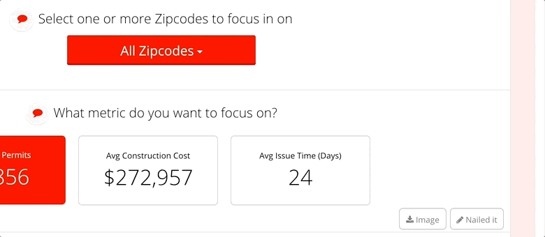

# Commands

## Writing app commands

Commands are code that runs on the server that is triggered by clicking a button on a slice.

Custom commands for an app should be placed in a `commands.py` file in the top directory of the app.

```text
app.yaml
theme.yaml
commands.py  <== App commands go here
public/
stacks/
```

Commands are customized by changing the Command Meta class.

Here’s a simple example of a commands.py file.

commands.py

```text
from jbcommands.jbcommandbase import JBCommand

class NailedItCommand(JBCommand):
    """
    The 'Hello World' of commands.
    """

    class Meta:
        name = 'nailed-it'
        label = 'Make a comment'
        icon = 'icon-comment-o'
        response_action = 'display'

    def execute(self):
        return "It is now {}".format(datetime.now())
```

Here’s what this looks like when run from a slice.



## Built-in commands

There are several built-in commands

| download-data: | Creates a downloadable Excel file. |
| :--- | :--- |
| download-image: | Downloads an image of the slice. |
| print-image: | Pops a print dialog to print an image of the slice. |
| post-to-slack: | Posts an image of a slice to a Slack channel. Requires app metadata. |

## Configuring commands

Commands can receive configuration that is provided in application metadata. See [Apps](../../reference-guide-contents/app.yaml.md) for more about metadata. Configuration should be placed in a `commands` dictionary with a key containing the name of each command that needs configuration. For instance:

```text
metadata:
    commands:
        post-to-slack:
            hook_url: {url}
            text: "This is cool."
            image_title: "Current status"
```

These values are available when the command executes in a dictionary `self.app_command_config`.

### Customizing built-in commands

Built-in commands can be customized by subclassing a built-in command and giving it a new name and new Meta options.

```text
from jbcommands.builtincommands import DownloadImageCommand

class CustomDownloadImage(DownloadImageCommand):
    """
    A customized Download image command
    """

    class Meta:
        name = 'custom-download-image'
        icon = 'icon-camera-retro'
        label = 'Download an image'
        data_type = 'slice'
        context = 'slice'
        response_action = 'download'
```

Here’s what this looks like.

