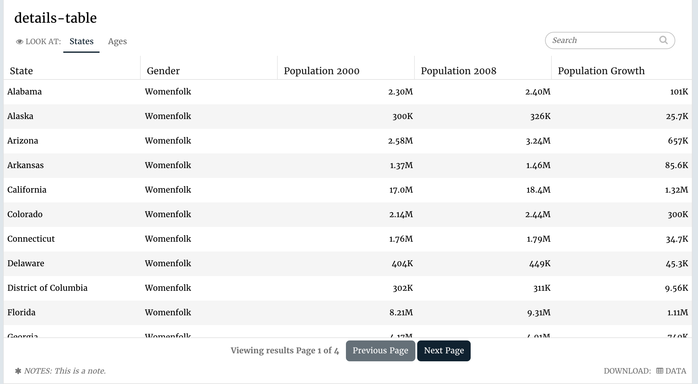

# Pagination in Slices

There are instances when the data given to the card or table slice is too much that it causes the page to become very slow or frozen when loaded. With pagination, the data service can send a chunk of the data to the front-end with additional data being requested by the pagination links \(like “next” and “prev”\).

## Front-end

The front-end renders a pagination widget at the bottom of the slice if the slice is configured to be paginated.



### Slice Config

To configure a slice to be paginated, set up it’s config like this:

```text
config:
  pagination:
    pageSize: 13
```

When the user clicks the “next” or “prev” links, additional pagination \(`_pagination`\) parameters are passed to the data service:

```text
{
  _selectedResponses:{foo: "Please give me a better name", bar: "Please give me a better name"}
  _pagination: { "page": 2, "q": "Nashville", "sort": ["-pop2000"] }
  exclusion:["vent_trach"]
  gender:["F"]
  metric:["pop2000"]
  ...
}
```

These pagination parameters are:

| page: | What page to return \(given the `config.pagination.pageSize`\). **REQUIRED** |
| :--- | :--- |
| q: | What search phrase to limit to \(given the search fields defined in config\). The backend is responsible for implementing search. **OPTIONAL** |
| sort: | An array of sort fields. Prefixing the field with a “-” indicates they are sorted in descending order. No prefix means ascending order. **OPTIONAL** |

### Selections

The selections in the slice are maintained across pages during searching, sorting and page traversal. However, if the slice is filtered by any of the slices above it or the global filters, the selections will be matched to the data in the response and only the matches maintained.

## Backend

If there is a `_pagination` parameter passed in the request, the data service needs to perform searching or sorting, and then return the appropriate page.

Search needs to be added to the recipe.

```text
recipe().dimensions('a', 'b').metrics('c').search('a','b', q="foo")
```

All recipes that need to response to a pagination request must implement a `order_by` clause in their recipes. Failing to do so will generate an exception:

```text
BadRecipe: Recipes that paginate must include a default order_by
```

When the data service returns the response for the paginated slice, it needs to tell the front-end which page of data it is returning and how many total items exist. This information is injected by the data service into `config.pagination` when the data service runs:

```text
{
'config': {
  'pagination':
    {
       page: 2,
       pageSize: 13,
       totalItems: 51
    },
'data': [{ 'name': 'items',  'values': [] }],
'metadata': {},
'name': 'Untitled',
'templateContext': {},
'version': '3'
}
```

