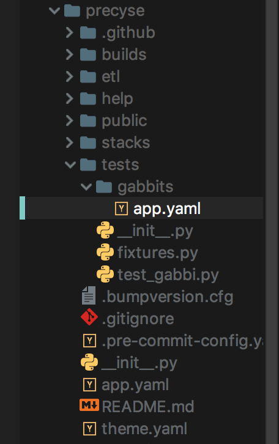

# Running Gabbi Tests

Juicebox includes the ability to run tests against the dataservices and app-level data using a testing framework called Gabbi. Similar to building the slices, tests against the slices are written in YAML. Before we get to that, we first must include a defined structure of directories and files that the Gabbi framework needs to be able to discover the tests.

## Directory Structure

The test directory should be found at the same directory level as the stacks directory, and everything related to tests should be placed within the tests/ directory.



## Necessary Files

There are a couple of files that must be within the tests directory for Gabbi tests to work correctly. We will need the test\_gabbi.py file, which Gabbi uses to load and run the tests. This file’s contents shouldn’t need to be changed in order to work with Juicebox

### test\_gabbi.py

```text
"""A test module to exercise the DataServices API with gabbi
This loads the yaml files in the gabbits directory and runs each
of them as a single ordered test suite.
"""

import os
import unittest

import fixtures
from gabbi import driver

TESTS_DIR = 'gabbits'

def load_tests(loader, tests, pattern):
    """Provide a TestSuite to the discovery process."""
    test_dir = os.path.join(os.path.dirname(__file__), TESTS_DIR)
    return driver.build_tests(test_dir, loader, host='localhost', port=8000,
                           fixture_module=fixtures)

if __name__ == '__main__':
    unittest.main()
```

We also need a fixtures files that will be used to imitate the authentication flow in Juicebox. There are a few places that will need to be modified to work with whatever application you are building the tests. Places that need to be modified are indicated in comments, surrounded by &lt;&lt; &gt;&gt; markers.

### **fixtures.py**

```text
import os

import requests
from gabbi import fixture

AOKEY = 62775
# <<replace this with the app slug>>
APP = 'jb3demo'
# <<replace this with the first stack slug in the list of stacks in app.yaml>>
AUTH_STACK = 'overview'


class PowerBarEmulationError(Exception):
    pass


class AuthFixture(fixture.GabbiFixture):
    def __init__(self, *args, **kwargs):
     super(AuthFixture, self).__init__(*args, **kwargs)
        self.session = requests.session()
        self.server = 'localhost:8000'
        # <<replace this with the email/password that you use to login to the locally
        # running version of Juicebox>>
        self.auth = ('testdev@example.com', 'wafflesandpancakesohmy')
        self.headers = {
            'origin': self.url(''),
            'accept-encoding': 'gzip, deflate, br',
            'accept-language': 'en-US,en;q=0.8',
            'upgrade-insecure-requests': '1',
            'user-agent': 'Mozilla/5.0 (Macintosh; Intel Mac OS X 10_11_6) '
                          'AppleWebKit/537.36 (KHTML, like Gecko) '
                          'Chrome/54.0.2840.71 Safari/537.36',
            'content-type': 'application/x-www-form-urlencoded',
            'accept': 'text/html,application/xhtml+xml,application/xml;q=0.9,'
                      'image/webp,*/*;q=0.8',
            'cache-control': 'max-age=0',
            'referer': self.url('admin/login/?next=/admin/'),
            'connection': 'keep-alive',
        }
        self._csrf = None
        self._session_id = None

    def url(self, x):
        return 'http://{}/{}'.format(self.server, x)

    @property
    def csrf(self):
        # grab a token if we have yet to do so
        if not self._csrf:
            self._csrf = self.session.get(
                self.url('api/v1/csrf')).json()['CSRF Token']
        # sometimes we get a new csrf token from another call responding
        # with a set-cookie header, if so let's update the variable
        if self._csrf not in self.session.cookies['csrftoken']:
            self._csrf = self.session.cookies['csrftoken']
        return self._csrf

    @property
    def session_id(self):
        if not self._session_id:
            self._session_id = self._create_new_session_id()
        return self._session_id

    def _create_new_session_id(self):
        '''Uses the django admin login form to create a session id. We use
        a django session instead of an auth token so that we can be compatible
        with the HSTM powerbar'''
        data = {
            'csrfmiddlewaretoken': self.csrf,
            'username': self.auth[0],
            'password': self.auth[1],
            'this_is_the_login_form': '1',
            'next': '/admin/'
        }
        r = self.session.post(self.url('admin/login/?next=/admin/'),
                              headers=self.headers, data=data)
        return r.cookies['sessionid']

    def _add_slice_urls_to_environ(self):
        '''Adds the URL of each slice into the environment variable
        dict so that regardless of the unique ID for each stack/slice
        it can be called by the same test.'''
        r = self.session.get(self.url('api/v1/app/{}/'.format(APP)),
                             headers={'content-type': 'application/json'})

        stacks = r.json()['stacks']
        for stack in stacks:
            # if we have more than one stack, we specify each slice slug with
            # the name of the stack, otherwise we just specify the slice slug
            prefix = 'URL_{}'.format(stack['slug']) if len(
                stacks) > 1 else 'URL'
            filter_key = '{}_{}'.format(prefix, 'filters')
            filter_key = filter_key.replace('-', '_').upper()
            os.environ[filter_key] = stack['filters_service']

            for slice in stack['slices']:
                slice_key = '{}_{}'.format(prefix, slice['slug'])
                slice_key = slice_key.replace('-', '_').upper()
                os.environ[slice_key] = slice['data_service']

    def _update_environ(self):
        cookies = 'csrftoken={}; sessionid={};'.format(
            self.csrf, self.session_id)
        os.environ['GABBI_AUTH'] = cookies
        os.environ['GABBI_CSRF'] = self.csrf
        self._add_slice_urls_to_environ()

    def start_fixture(self):
        self._update_environ()
```

Additionally, if you are building healthstream apps, you will likely need this additional class to emulate the powerbar.

```text
class AuthFixtureHSTM(AuthFixture):
    def _update_session_id_with_org(self, org_id):
        '''Makes a call to the app/stack with the specified external_org_id
        to update the user.extra tied to the django session id, emulating
        usage of the HSTM Powerbar'''
        data = {'csrfmiddlewaretoken': self.csrf,
                'external_organization_id': org_id}
        app_url = self.url('{}/{}'.format(APP, AUTH_STACK))
        r = self.session.post(app_url, data=data,
                              headers=self.headers)

        if r.status_code is not requests.codes.ok:
            raise PowerBarEmulationError(
                'Could not update the user extra with the '
                'externalOrgId: {}'.format(AOKEY))

    def start_fixture(self):
        self._update_environ()
        self._update_session_id_with_org(AOKEY)
        self._update_environ()
```

## Writing Tests

All the tests should be yaml files, and should be located within the gabbits/ subdirectory. The tests often require passing in a URL to test the response of. Additionally, the tests often will be written in json xpath syntax. For more information, visit:

* [Gabbi Docs](https://gabbi.readthedocs.io/en/latest/)
* [Examples of Gabbi tests](https://gabbi.readthedocs.io/en/latest/example.html)
* [Json Path information](https://gabbi.readthedocs.io/en/latest/jsonpath.html)
* [Json Path library](https://jsonpath-rw.readthedocs.io/en/latest/)

### Example test of app level data

```text
fixtures:
  - AuthFixtureHSTM
defaults:
  request_headers:
  cookie: $ENVIRON['GABBI_AUTH']
  content-type: application/json
  X-CSRFToken: $ENVIRON['GABBI_CSRF']
tests:
  - name: Base App Redirect
    url: /overview/
    status: 302 || 301
  - name: overview existence
    url: /api/v1/app/overview/
    response_json_paths:
      $.slug: overview
      $.label: Jb3 Demo
  - name: overview stack info
    url: /api/v1/app/overview/
    response_json_paths:
      $.stacks.`len`: 1
      $.stacks[0].slug: overview
      $.stacks[0].label: Overview
  - name: overview app metadata details
    url: /api/v1/app/overview/
    response_json_paths:
      $.metadata..has_powerbar: true
      $.metadata..demo_org: 555
      $.metadata..link: overview
      $.metadata..feature_ids[0]: 55555
```

