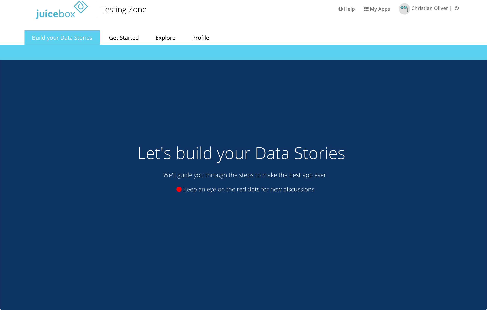

# Styling Slices

You can vary the look of a slice through it's `style` config. For example, the following `title-large` attribute is often use on an introductory slice to make the slice title of a slice large and centered:

```yaml
style:
- "title-large"
```

Here are all the available attributes:

`section-header`: Use on a freeform slice to make a section header.

`section-content`: Apply to all slices of a section except the header.

`section-last`: Apply to the last slice in a section.

`title-large`: Makes the slice title bold, centered, and large.

`background-transparent`: Makes the slice background transparent.

`alignment-center`: Centers the visualization slice content.

`card`: Makes the slice feel like a card standing alone. Note, this doesn't work with sections styling.

`wide`: Take up the full width of the browser window.

`no-snapshot`: Remove the snapshot button on a slice. Note: This should only be done if the slice doesn't have live data that someone may want to share or discuss.

`cover`: Makes the slice large and take up the entire screen.

### cover

Makes the slice large and take up the entire screen. This is great for highlighting important content without getting distracted by other slices. This is great for large statements, or places you'd like users to focus on content without getting distracted by content from other slices.

```yaml
style:
  - "cover"
```

**Free-form example**



```yaml
style:
  - "no-snapshot"
  - "alignment-center"
  - "cover"
```

While most slice will center their content, some slices look good with their content filling the entire screen

**Map example**


```yaml
style:
- "alignment-center"
- "cover"
```

## Grouping Slices into Sections

A Juicebox stack can be thought of as an interactive short-story, with scenes or "Sections," as we call them. Sections are groups of slices that present useful data in bite-size, but unique sequential parts. Like paragraphs to writing or topical sections in a presentation, they help break down the information into delicious bites. As in a stack, the fewer, more focused slices in a section, the better.

Here's a picture of the meaningful parts, and some styling configuration hints:


### Creating a section

The above image has a section made of two slices: a header slice, and another slice.

The header is created from a freeform slice and text for the `title` and `section-header` in the `style` config:

```yaml
# Section Header
- slice_type: "free-form"
  title: "First, let’s see how that [metric] is performing for [13.1k Viewers]."
  style:
  - "section-header"
  mixins:
  - "class": "WithNoData"
    "options": {}
    "target": "view"
  data_service: "blank.json"
```

All additional slices all should have the `section-content` attribute. The last slice in a section gets both the `section-last` attribute and the `section-content` attribute:

```yaml
style:
- "section-content"
- "section-last"
```

