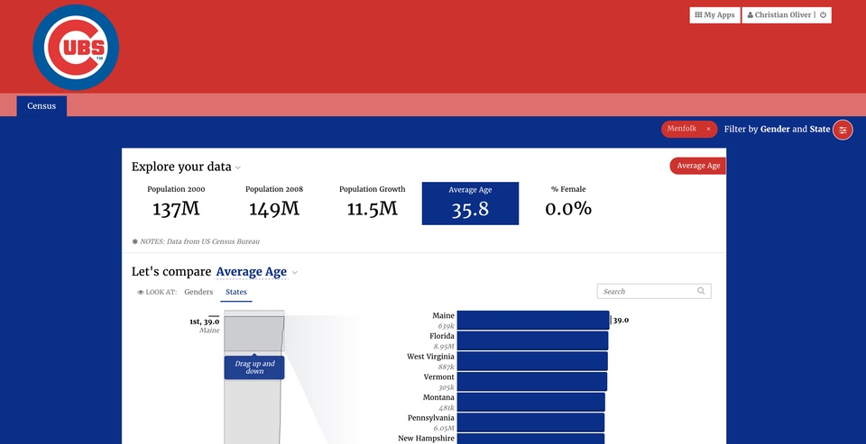

# backgrounds

## Styling Backgrounds

Stacks and slices can define backgrounds using a `background` property in yaml. Stacks can also define a separate background for the top of the page using `header`. Backgrounds can be images, patterns, gradients or colors. You can even layer multiple backgrounds together.

### Header Background

Stack header buttons and text should be clearly readable against their header background designated in `stack.yaml`. If your header is given a dark contrasting background, add the stack name to `$theme-style-header-dark-stacks` as a config setting in `theme.yaml`.

For example, in the following config setting, the stacks typography and buttons have dark headers:

```text
$theme-page-header-style-dark-stacks: typography, buttons;
```

If you have multiple stacks with dark headers, use commas to separate them.

Here is how to build the different types of backgrounds.

### Image Background

|  |  |
| :--- | :--- |
| image | A url or an image in your app's public/img directory |
| extra | Optional extra css properties for your image that are supported by the css background property. For instance, you can set an image to be centered, fixed and no-repeating with `no-repeat fixed center` |
| config | A key/value list of modifications supported by the imgix url api. See [https://docs.imgix.com/apis/url](https://docs.imgix.com/apis/url) |

Here's an example of a **stack.yaml** `header` and `background` using images.

```python
header:
  image: 'http://www.cookandsonbats.com/panoramas/wrigley/wrigley-404-504.jpg'
  config:
    w: 1920
    blur: 50
background:
  - image: 'http://a.fssta.com/content/dam/fsdigital/fscom/mlb/images/2015/07
  /27/072715-7-MLB-Chicago-Cubs-OB-PI.vresize.1200.675.high.6.jpg'
    extra: "0 250px"
    config:
      w: 1920
      sepia: 100
```

The first image is blurred with a width of 1920 pixels. The second image is sepia toned with a width of 1920 pixels. It uses the extra to move that image down 250px. In the app, this looks like:


### Improving Readability

If there is an image used in the header where the contrast doesn't seem strong enough, try tinting your image with another color through the config. In the following example, the blend color is chosen, the blend mode `bm` is set to normal, and it is made slightly transparent with `balph`.

```python
background:
```

> \# Set the story image: - image: APA\_image.jpg config: blur: 8 \# Set the blend to the primary color: blend: "005499" bm: normal balph: 70 h: 540 extra: "0/cover no-repeat"

 If you use blend, surround the color by quotes so it's not treated as an integer.

### Pattern Background

pattern

: A pattern name. Possible values are:

> * bricks
> * hexagons
> * overlapping\_circles
> * overlapping\_rings
> * plaid
> * plus\_signs
> * rings
> * sinewaves
> * squares
> * triangles
> * xes

extra

: Optional extra css properties for your image that are supported by the css background property.

config

: Configuration options include color, scale, seed, and opacity.

color

: A hexadecimal string \(like '\#ff6600'\) or a html color name \(like 'goldenrod'\) that defines the base color of the pattern.

scale

: An integer between 0 and 15 that affects how large the pattern is.

seed

: A string that defines a random starting point for the pattern . This can usually be omitted.

opacity

: A number between 0.0 and 1.0 that defines how transparent the background is. 0.0 is completely transparent.

Here's an example of a stack.yaml `header` and `background` using patterns.

```python
header:
  pattern: 'plus_signs'
  config:
    color: '#CC3433'
    scale: 4
background:
  pattern: 'overlapping_rings'
  config:
    color: '#0E3286'
    scale: 12
```

The first image is a relatively small plus\_sign pattern using the accent color. The second image is a larger ring pattern using the primary color.


This table shows examples of all patterns at small, medium, and large scales.

```python
background:
  - pattern: {pattern}
    config:
      color: "#F05C5E"
      scale: {scale}
```

#### Pattern Examples

### Gradient Background

gradient

: A css3 gradient to use. You only need to specify the linear-gradient or radial-gradient.

extra

: Optional extra css properties for your gradient that are supported by the css background property. For instance, you can set an pattern to be centered, fixed and no-repeating with `no-repeat fixed center`

Here's an example of a stack.yaml `header` and `background` using gradients. A good source of visually interesting gradients is [http://uigradients.com/](http://uigradients.com/)

```python
header:
  gradient: 'linear-gradient(to bottom, #7b4397 , #dc2430)'
background:
  gradient: 'linear-gradient(to left, #7b4397 , #dc2430)'
```


### Color Background

|  |  |
| :--- | :--- |
| color | A hex, rgb, rgba, or css named color to use. Be sure to enclose this in quotes like `'#CC3433'` |
| extra | Optional extra css properties for your color that are supported by the css background property. For instance, you can set an pattern to be centered, fixed and no-repeating with `no-repeat fixed center` |

Here's an example of a stack.yaml `header` and `background` using colors.

```python
header:
  color: '#CC3433'
background:
  color: '#0E3286'
```

The header uses the accent color and the body background uses the primary color.



## Layering multiple backgrounds

You can combine images, gradients, colors and patterns to create sophisticated effects. The background property can take a list of backgrounds as defined above. The first item in the list will be on top and the others will appear as layers below it. Here's an example:

```python
header:
  - gradient: 'linear-gradient(to right, rgba(0, 0, 0, 0.5) , rgba(0, 0,
   0, 1))'
  - image: 'http://subtlepatterns2015.subtlepatterns.netdna-cdn.com/patterns/grey_wash_wall.png'
background:
  - gradient: 'linear-gradient(to bottom, rgba(255, 255, 255, 0) , rgba(0, 0,
   0, 1))'
  - pattern: 'squares'
    config:
      color: '#333333'
      scale: 6
      opacity: 0.2
  - image: 'http://a.fssta.com/content/dam/fsdigital/fscom/mlb/images/2015/07/27/072715-7-MLB-Chicago-Cubs-OB-PI.vresize.1200.675.high.6.jpg'
    extra: "0 250px"
    config:
      w: 1920
      sepia: 100
```

The header has a background grey pattern image from [http://subtlepatterns.com](http://subtlepatterns.com) with a gradient fading to full black on the right on top of the pattern. The background has an image with a dark squares pattern on top and a final fade to black gradient on top of that.

Here's what it looks like together.


