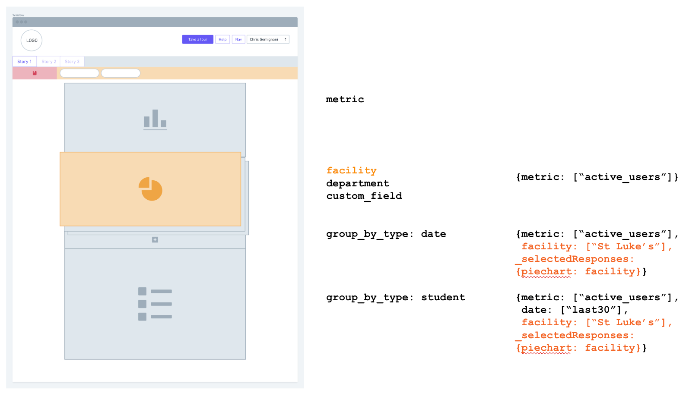

# Getting Started

## What is Juicebox?

Juicebox lets you build and share data stories. These stories are built using Python code and YAML configuration.

Juicebox **Apps** are made up of **Stories** and **Stories** are built using **Slices**.

A Juicebox story looks like this. A Story is a list of Slices where each Slice filters data in the slices below it.

### How Slices Interact

Every data driven element in a slice has a `group_by_type`. This describes the kind of data represented by that element. Examples of group\_by\_types are `student` \(if you were showing a list of students in a school-based story\), `country` \(if you were showing a map\), `hospital` or `patient` if you were telling a story about medical data.

The `group_by_type` selections made in a slice are passed downward to all slices below. Those slices can handle the selections automatically \(for instance, by filtering data to a selected country\) or in a customized way.

Here's an example of a simple story with the group\_by\_types labeled for each slice.

When a user is looking at the story the selections are passed down. Here's the same example with some selections made in each slice and passed down to the slices below it.


#### Who does the thinking?

The Juicebox frontend only knows about group\_by\_types and how many items can be selected in each slice. The frontend doesn't know what those items are or what they mean.

Logic about what should happen when selections are made is the responsibility of data services.


### Global filters

Global filters are a special kind of slice that has selections that apply to all slices in the story. Global filters are accessible in the filter bar and global filter selections apply to all slices in the story.

### Datasets

Sometimes we want to show multiple parallel breakouts in a slice. For instance in a medical story, we may want to see the number of patients by facility or by department or by some custom grouping.

If we look back at our view of the full story, it looks like this.

Only one of the pie chart datasets can be active at a time. The active pie charts selection **and** the fact that the facility dataset is selected are passed to slices below.

### About selections in Juicebox stories

Once all slices have loaded, Juicebox stores all the selections a user has made. If a user returns to a story, Juicebox will restore the selections they had made when they last looked at the story.

Slices can limit the number of selections that can be made in a slice. We'll learn more about this in [Slice common configuration](../reference-guide-contents/slices/slices-and-common-configuration.md).

However, what a user sees is limited by their data permissions. **Which can change!**

What the user sees is also limited by the data that is available. **Which can also change!**

Whenever data is loaded \(either the story is being loaded for the first time or while a user is looking at the story\), the slice will look at the new data and attempt to restore the selections that had been made before**.** After selection matching, constraints are applied to get the new selected items.

