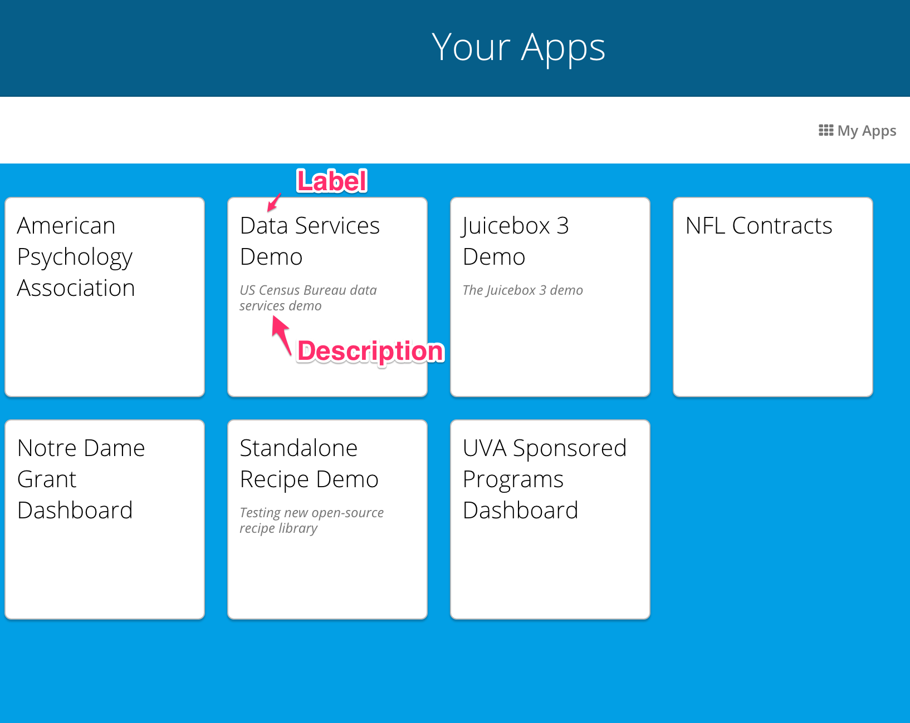

# app.yaml

## app.yaml Options

The `app.yaml` file defines application-level settings for a Juicebox app. Here is what a sample app.yaml file looks like, and then on the table below it you can see what each piece is doing.



```yaml
id: "ABCDEFGH"
label: "My New App"
slug: "mynewapp"
description: "This is an app about the first 8 letters of the alphabet"
use_discussions: true
discussions_group_property: "changeme"
show_help: false
juicebox_version: "4"
metadata:
   version: "1.0.0"
   auto_inject_story_chooser: true
   logging:
       SENTRY_DSN: https://...
   invitations:
       subject: "Welcome to HealthyCo"
       body: "This app will help you explore HealthyCo's performance."
   commands:
       my-custom-command:
           url: http://www.google.com
   embed:
       link_duration: 300
stacks:
- "A"
- "B"
- "The Rest"
```



| Key | Optional | Value | Description |
| :--- | :--- | :--- | :--- |
| id | No | An 8 character string | A globally unique id across all Juicebox apps. This will be assigned for you automatically when you run `jb create {appname}` |
| label | No | An up to 70 character string | The name of your new app. This can be anything you want up to 70 characters. |
| slug | No | An up to 70 character string with no spaces \(better if its short\) | Appears in the url for the stack like `www.juiceboxdata.com/{appslug}/{stackslug}/.` This should be unique among all apps. |
| description | No | A string that is a short description of app | An extended description of your app. This will appear on the app home page. |
| metadata | Yes | An object containing configuration. | Metadata provides extra configuration for this application. The following options are supported. More info and options are [here](app.yaml.md#metadata). |
| show\_help | No | true\|false | Should a help link be displayed for this app. For more about help see [Building help](https://docs.juiceboxdata.com/projects/juicebox/topics/guidance/help.html#building-help). \(this sections isn't done yet\) |
| use\_discussions | No | true\|false | Are discussions enabled in this app? \(in app commenting\) |
| discussions\_group\_property \([WARNING](app.yaml.md#warnings)\) | Yes - Not needed if use\_discussions is false | A property  on user.extra. If an empty string, all users that can access an app share discussions with each other. | A property of `user.extra` that controls who users can talk to in discussions. If blank, everyone with access to the app can discuss together. Only users who share the same `discussions_group_property` value in their user.extra can share discussions. |
| juicebox\_versions | No | '3'\|'4' | The file layout and engine this Juicebox app runs against. [Juicebox File Layout](juicebox-file-structure.md) |
| is\_public \([WARNING](app.yaml.md#warnings)\) | Yes - default is false | true\|false | This makes an app available to anyone who hits the url without requiring them to be logged in. |
| is\_mobile \([WARNING](app.yaml.md#warnings)\) **Also, is this even used?**  | Yes - default is false | true\|false | Enables an application to be tagged as “mobile”. In this case an extra popup will appear prompting users to save the app to their home screen on a iOS or Android device. |
| stacks | No | A YAML list of stacks | A list of directories containing stack definitions that you want to appear in this app. More details: [Stacks](stacks/). |



### metadata

Metadata provides extra configuration for this application. The following options are supported.

* `version`: A semantic version number for this Juicebox app. This may be maintained using a tool like `bumpversion`.
* `commands`: Configuration for commands. Each command will be a key. For more see [Configuring commands](https://docs.juiceboxdata.com/projects/juicebox/topics/interactivity/slice_commands.html#configuring-commands) \(NOT DONE YET, NEEDS TO LINK TO NEW DOCS\).
* `logging`: Configuration for application logging. If the logging block contains a Sentry DSN \([https://docs.sentry.io/quickstart](https://docs.sentry.io/quickstart)\), data service errors that occur will be logged to that endpoint.
* `invitations`: Configuration for invitations to this app. `subject` and `body` will appear in an email when a user is invited to this app.
* `auto_inject_story_chooser`: A flag to indicate if the story-chooser slice should be automatically injected in all the stacks for this app. Defaults to `false`.
* `embed`: An object containing config for app embedding. Currently we have only one configuration `link_duration` – expiration time of embed urls, in seconds\(default=60\).

### Warnings


`discussions_group_property:` If you change this it resets all discussions users are following.

`is_public:` Public apps **do not** support discussions or `user.extra` based data permissions.

`is_mobile:` The code to support this has not been maintained and iOS and Android have been moving away from supporting home screen links.


## Footers

A footer is added at the bottom of every app that shows both the version of Juicebox being run, as well as an app version if it has been set up in the `app.yaml` metadata config.

The footer may also be customized in the app Django admin view. Check “Show footer” at the bottom of that page to show your customized footer.


When the footer is customized, the “Powered by Juicebox” disappears.


