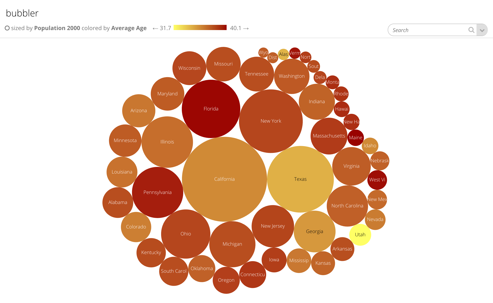
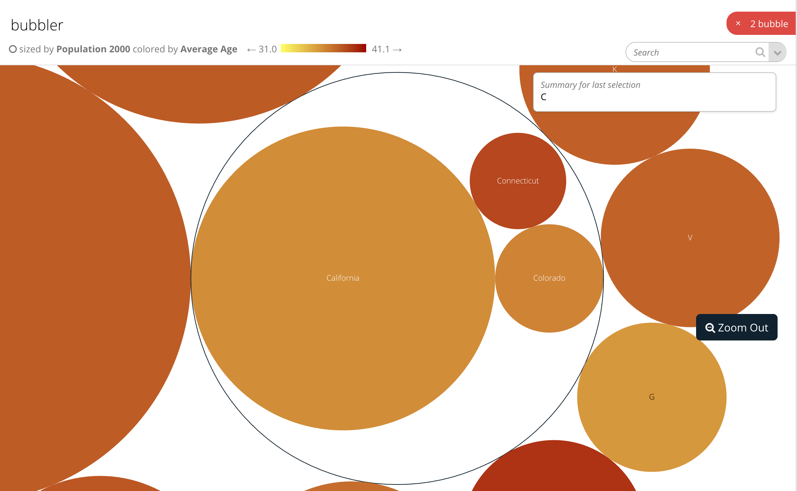
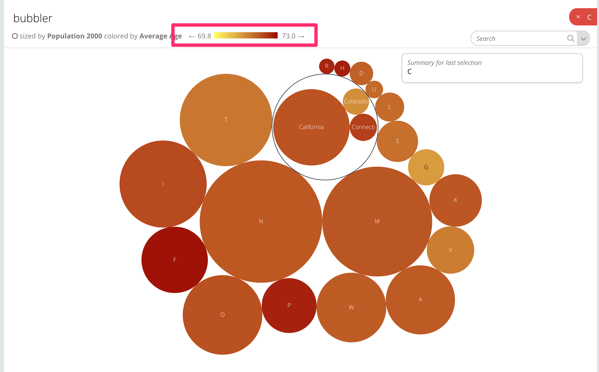

# Bubble

## Bubble config

Bubble slices support the [Common configuration options for all slices](https://docs.juiceboxdata.com/projects/juicebox/topics/juicebox_reference/slices/common_configuration.html). Additional options are:

### descriptionTemplateName

CSS selector of the template that is supposed to render selected node’s details/description in the breadcrumb,

<table>
  <thead>
    <tr>
      <th style="text-align:left">Optional:</th>
      <th style="text-align:left">Yes, there is a default template that renders the label</th>
    </tr>
  </thead>
  <tbody>
    <tr>
      <td style="text-align:left">Values:</td>
      <td style="text-align:left">CSS selector</td>
    </tr>
    <tr>
      <td style="text-align:left">Example:</td>
      <td style="text-align:left">
        <p>config:</p>
        <p>descriptionTemplateName: &#x201C;#bubble-description-template&#x201D;</p>
      </td>
    </tr>
  </tbody>
</table>### colorFieldRange

Min/max values of a color field. This range defines the bubble’s circle fill color. The text label color \(on top of that circle\) is determined by the front-end dynamically. The app tries to use complimentary/inverse color for text for easier readability \(eg. dark text on light circle\).

<table>
  <thead>
    <tr>
      <th style="text-align:left">Optional:</th>
      <th style="text-align:left">yes, by default the app will dynamically calculate the range of the colorField
        values in the data</th>
    </tr>
  </thead>
  <tbody>
    <tr>
      <td style="text-align:left">Values:</td>
      <td style="text-align:left">array of two numeric values</td>
    </tr>
    <tr>
      <td style="text-align:left">Example:</td>
      <td style="text-align:left">
        <p>config:</p>
        <p>colorFieldRange: &#x201C;[0, 100]&#x201D;</p>
      </td>
    </tr>
  </tbody>
</table>### colorField

Name of the field in the data item that will be used to map to the color of a bubble. This field defines the bubble’s circle fill color. The text label color \(on top of that circle\) is determined by the front-end dynamically. The app tries to use complimentary/inverse color for text for easier readability \(eg. dark text on light circle\).

<table>
  <thead>
    <tr>
      <th style="text-align:left">Optional:</th>
      <th style="text-align:left">yes, default is <code>value</code>
      </th>
    </tr>
  </thead>
  <tbody>
    <tr>
      <td style="text-align:left">Values:</td>
      <td style="text-align:left">string</td>
    </tr>
    <tr>
      <td style="text-align:left">Example:</td>
      <td style="text-align:left">
        <p>config:</p>
        <p>colorField: &#x201C;myColorField&#x201D;</p>
      </td>
    </tr>
  </tbody>
</table>### sizeField

Name of the field in the data item that will be used to map to the size of a bubble

<table>
  <thead>
    <tr>
      <th style="text-align:left">Optional:</th>
      <th style="text-align:left">yes, default is <code>value</code>
      </th>
    </tr>
  </thead>
  <tbody>
    <tr>
      <td style="text-align:left">Values:</td>
      <td style="text-align:left">string</td>
    </tr>
    <tr>
      <td style="text-align:left">Example:</td>
      <td style="text-align:left">
        <p>config:</p>
        <p>sizeField: &#x201C;mySizeField&#x201D;</p>
      </td>
    </tr>
  </tbody>
</table>### popSound

A URL to the sound that should play when a bubble is “popped”

| Optional: | yes, by default there is no sound |
| :--- | :--- |
| Values: | URL string |
| Example: |  |

### height \(bubble\)

The height \(in px\) of the chart

| Optional: | yes, default is 400 |
| :--- | :--- |
| Values: | number |
| Example: |  |

## Flavors of Bubble

There is a default renderer that can be used. This renderer works for fixed hierarchies only \(like country/region/city\). Dynamic trees \(like a company’s reporting structure aren’t supported\).

This renderer works by gathering data from a recipe at each level of the hierarchy. The data is then structured into a tree.

### sizeField \(bubble\)

| Optional: | yes, \(uses config.sizeField if not provided\). This metric must be used in the recipe\(s\) |
| :--- | :--- |
| Values: | string |

### colorField \(bubble\)

| Optional: | yes, \(uses config.colorField if not provided\). This metric must be used in the recipe\(s\) |
| :--- | :--- |
| Values: | string |

### group\_by\_type

All selections in a slice must have the same group\_by\_type. If the bubble has more than one level, set a group\_by\_type.

| Optional: | yes, uses the first level if not provided. |
| :--- | :--- |
| Values: | string |


group\_by\_type and slice item ids:

Slices must have a single group by type but hierarchical slices support selection at multiple levels of the hierarchy. For instance if the hierarchy were country/region/city, a user can perform selections at multiple levels, like: Canada, United States/Tennessee and Germany/Bavaria/Munich.

The render\_config should include a group\_by\_type and the ids of the levels will be concatenated using a ‘~’

```text
render_config={'group_by_type': 'country_hierarchy',
'levels': ['country', 'region', 'city']}
```

The selection that lower slices receive would look like

```text
country_hierarchy: ['Canada', 'United States~Tennessee', 'Germany~Bavaria~Munich']
```

Slices receiving this filtering need to use custom filters to decide what to do with these selections.


### levels

A list of levels to use in the bubble. Generally the same as the dimensions used in the recipe. These have to be specified explicitly because dimension order is not maintained in recipes.

| Optional: | no, A list of levels to use in the bubble. Generally the same as the dimensions used in the recipe. These have to be specified explicitly because dimension order is not maintained in recipes. |
| :--- | :--- |
| Values: | list of strings |

### levelsData

An optional list of data at each level starting from the root. Must be have length one greater than levels because it includes the root data.

| Optional: | yes |
| :--- | :--- |
| Values: | list of recipe.all\(\) |

Note

When to use levelsData

If levelsData isn’t supplied, the renderer will generate recipes for all levels above the rendered recipe. These recipes will be generic, they won’t include any extra filtering that the rendered recipe used. So if the rendered recipe just uses dimensions and metrics you can use this automatic behavior. If the rendered recipe uses filtering, you need to construct a recipe for each level.

Here’s an example of levelsData in action. It’s needed because the recipes use the filter Census.age&gt;60

```text
def build_response(self):
        metrics = ('avgage', 'pop2000')
        dims = ('first_letter_state', 'state')
        recipe = self.recipe().dimensions(*dims).metrics(*metrics)
        levelsData = [
        self.recipe().dimensions().metrics(*metrics).filters(Census.age>60).all(),
        self.recipe().dimensions('first_letter_state').metrics(*metrics).filters(Census.age>60).all(),
        self.recipe().dimensions('first_letter_state', 'state').metrics(*metrics).filters(Census.age>60).all(),
        ]
        self.response['responses'].append(recipe.render(
        render_config={
                'levels': dims,
                'colorField': metrics[0],
                'sizeField': metrics[1],
                'levelsData': levelsData
        }))
```

### Examples of Bubble Renderer

Here are some examples of the bubble slice renderer.

#### One level \(group\_by\_type will be state\)

```text
def build_response(self):
    metrics = ('avgage', 'pop2000')
    dims = ('state',)
    recipe = self.recipe().dimensions(*dims).metrics(*metrics)
    self.response['responses'].append(recipe.render(
        render_config={
            'levels': dims,
        }))
```



#### Three level with custom group\_by\_type

When using multiple levels it’s recommended to use a custom group\_by\_type

```text
def build_response(self):
    metrics = ('avgage', 'pop2000')
    dims = ('first_letter_state', 'state', 'sex')
    recipe = self.recipe().dimensions(*dims).metrics(*metrics)
    self.response['responses'].append(recipe.render(
        render_config={
            'levels': dims,
            'colorField': metrics[0],
            'sizeField': metrics[1],
            'group_by_type': 'bubble',
        }))
```



#### Two level with custom filtering

Custom filtering means you need to supply levelData. This filtering is limiting data to people with age over 60.

```text
def build_response(self):
    metrics = ('avgage', 'pop2000')
    dims = ('first_letter_state', 'state')
    recipe = self.recipe().dimensions(*dims).metrics(*metrics)
    levelsData = [
        self.recipe().dimensions().metrics(*metrics).filters(Census.age>60).all(),
        self.recipe().dimensions('first_letter_state').metrics(*metrics).filters(Census.age>60).all(),
        self.recipe().dimensions('first_letter_state', 'state').metrics(*metrics).filters(Census.age>60).all(),
    ]
    self.response['responses'].append(recipe.render(
        render_config={
            'levels': dims,
            'colorField': metrics[0],
            'sizeField': metrics[1],
            'group_by_type': 'bubble',
            'levelsData': levelsData
        }))
```



