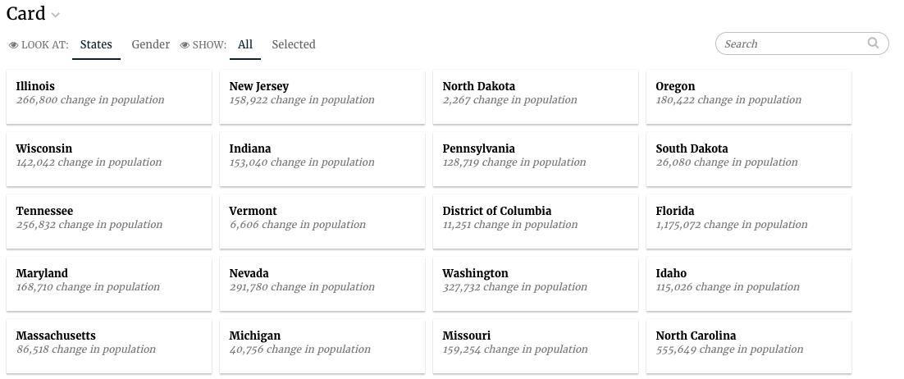

# Card Slice

A card slice is used to display record details in a searchable sortable way.



## Card config

Card slices support the [Common configuration options for all slices](../slices/slices-and-common-configuration.md). Additional options are:

### cardTemplateName

The name of the template that will be used to render the content inside the card. Should start with a \# and be defined in templates.html.

| Optional: | No. If not specified, an empty string is rendered for the card content. |
| :--- | :--- |
| Values: | A CSS selector that exists in templates.html |
| Example: |  |

### cardWidth

The width in pixels/percentage of the card

| Optional: | Yes. The default is 250px |
| :--- | :--- |
| Values: | String or number |
| Example: |  |

### searchFields

The data attributes to be used for searching.

| Optional: | Yes. Default is `["label"]` |
| :--- | :--- |
| Values: | An array of strings |
| Example: |  |

### sortFields

The data attributes to be used for sorting, can specify {field, label, sortDirection, default}.

| field: | The field to sort on |
| :--- | :--- |
| label: | The displayed name in the sort picker |
| sortDirection: | optional, can be “ascending”, “descending” or “natural”, default is ascending, natural means no-sorting takes place. |
| default: | true\|false, should this sort be selected by default. |
| Optional: | Yes. There is no default |
| Values: | An array of objects as described above |
| Example: |  |

## Yaml/HTML example of a Card Slice

A basic card slice example in stack.yaml:

```text
- slice_type: "card"
  slug: "jam-card1"
  title: "Card"
  config:
    "cardTemplateName": "#jam-card-template"
  data_service: "censusv2service.CardV3Service2"
```

And the template for the individual cards:

```text
<script type="text/template" id="jam-card-template">
  <div class="fr-body2"><%= datum.label %></div>
  <div class="fr-caption"><%= datum.format("popdiff", ',.0f') %> change in population</div>
</script>
```

## Linking to websites or files

You can now add and click on hyperlinks in the card slice and it will not interfere with the selection of the card item.

```text
<script type="text/template" id="jam-card-template">
  <div class="fr-body2"><%= datum.label %></div>
  <div class="fr-caption"><%= datum.format("popdiff", ',.0f') %> change in population</div>
  <div class="fr-menu">
    <a href="http://www.juiceanalytics.com" target="_blank">Visit website</a>
  </div>
</script>
```

