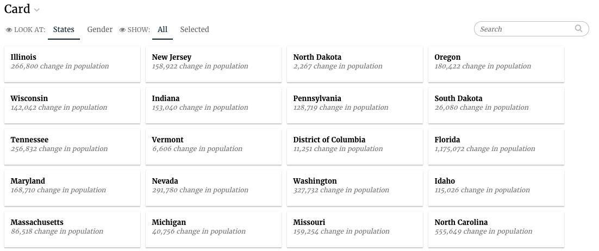

# Card Slice

## Card config

Card slices support the [Common configuration options for all slices](https://docs.juiceboxdata.com/projects/juicebox/topics/juicebox_reference/slices/common_configuration.html). Additional options are:

### cardTemplateName

The name of the template that will be used to render the content inside the card. Should start with a \# and be defined in templates.html.

| Optional: | No. If not specified, an empty string is rendered for the card content. |
| :--- | :--- |
| Values: | A CSS selector that exists in templates.html |
| Example: |  |

### cardWidth

The width in pixels/percentage of the card

| Optional: | Yes. The default is 250px |
| :--- | :--- |
| Values: | String or number |
| Example: |  |

### searchFields

The data attributes to be used for searching.

| Optional: | Yes. Default is `["label"]` |
| :--- | :--- |
| Values: | An array of strings |
| Example: |  |

### sortFields

The data attributes to be used for sorting, can specify {field, label, sortDirection, default}.

| field: | The field to sort on |
| :--- | :--- |
| label: | The displayed name in the sort picker |
| sortDirection: | optional, can be “ascending”, “descending” or “natural”, default is ascending, natural means no-sorting takes place. |
| default: | true\|false, should this sort be selected by default. |
| Optional: | Yes. There is no default |
| Values: | An array of objects as described above |
| Example: |  |

## Flavors of Card

### Default \(card\)

The default flavor renders the first supplied dimension as the card label, and returns all the metrics and dimensions by name in the response to be used in the template.



The code for the default card flavor looks as follows:

```text
class CardV3Service2(CensusService):
    def build_response(self):
        self.metrics = ('popdiff',)
        self.dimensions = ('state',)

        recipe1 = self.recipe().metrics(*self.metrics).dimensions(
            *self.dimensions)

        self.response['responses'].append(recipe.render())
```

The slice in stack.yaml:

```text
- slice_type: "card"
  slug: "jam-card1"
  title: "Card"
  config:
    "cardTemplateName": "#jam-card-template"
  data_service: "censusv2service.CardV3Service2"
```

And finally the template for the individual cards:

```text
<script type="text/template" id="jam-card-template">
  <div class="fr-body2"><%= datum.label %></div>
  <div class="fr-caption"><%= datum.format("popdiff", ',.0f') %> change in population</div>
</script>
```

## Mixins

### CardActionPlannerViewMixin

This is a mixin that is and will only be used by HSTM apps. The data service for the slice that uses this mixin should pass additional context in the response like this:

```text
response['templateContext']['defaultItem'] = {'questions': selected_question,
                                    'title': ' ',
                                    'description': description,
                                    'clientident': ci,
                                    'unitident': ui,
                                    'due_date': datetime.now().date(),
                                    'created_by': self.request.user.get_full_name()}
```

## Linking to websites or files

You can now add and click on hyperlinks in the card slice and it will not interfere with the selection of the card item.

```text
<script type="text/template" id="jam-card-template">
  <div class="fr-body2"><%= datum.label %></div>
  <div class="fr-caption"><%= datum.format("popdiff", ',.0f') %> change in population</div>
  <div class="fr-menu">
    <a href="http://www.juiceanalytics.com" target="_blank">Visit website</a>
  </div>
</script>
```

