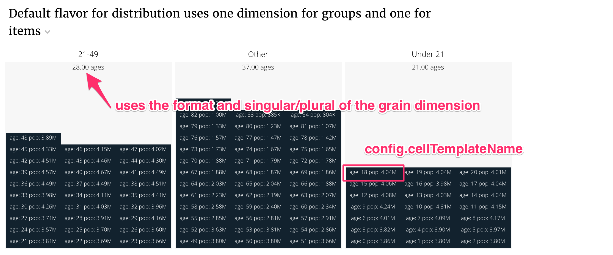
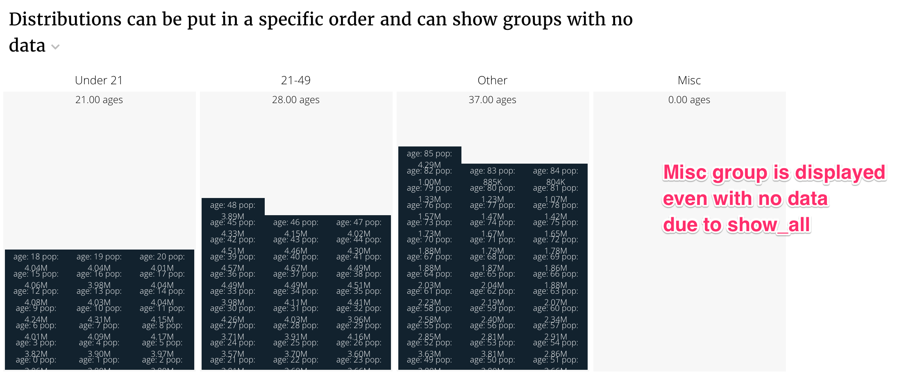
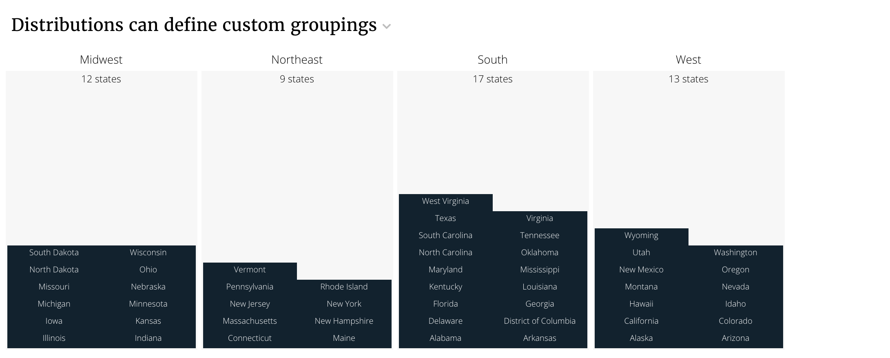
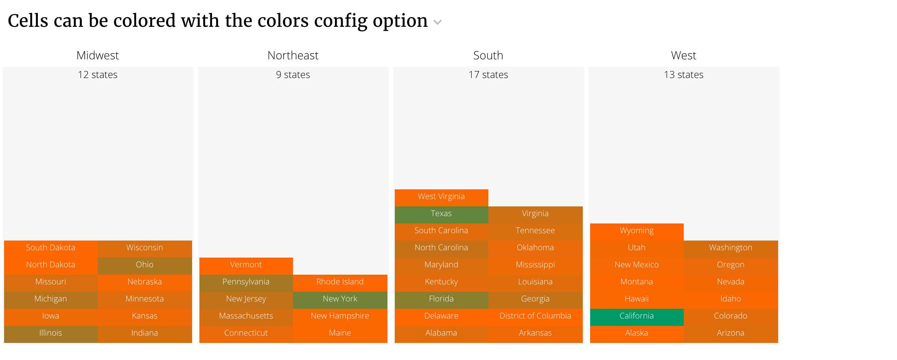
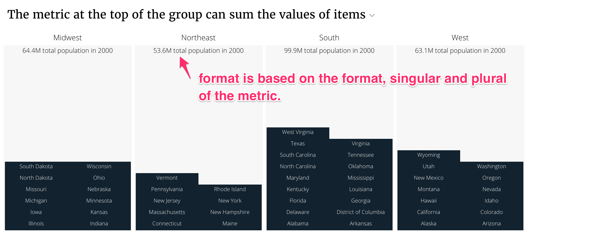
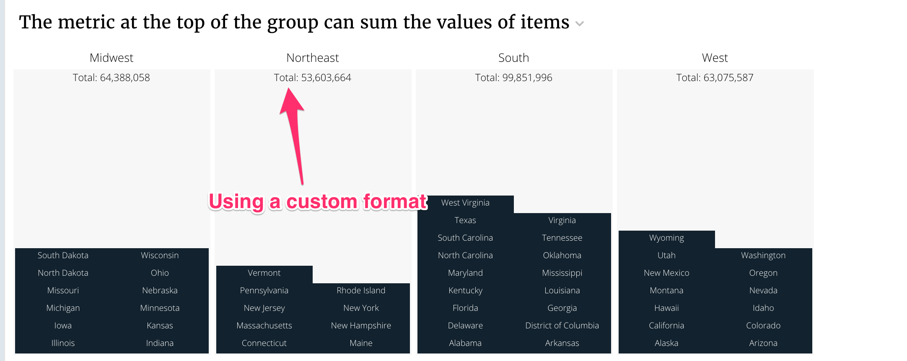
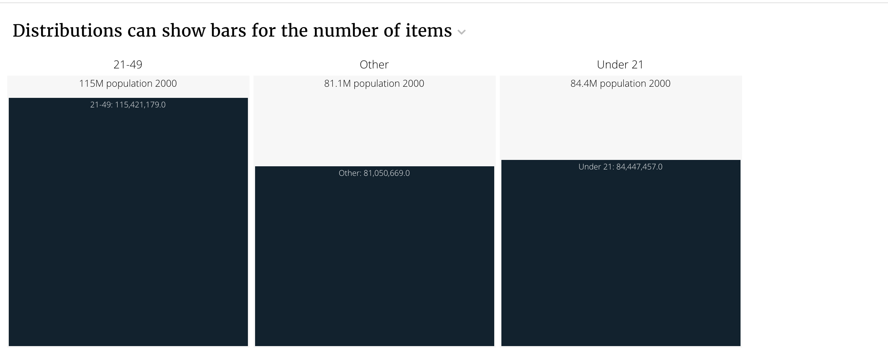

# Distribution

## Distribution config

Distribution slices support the [Common configuration options for all slices](https://docs.juiceboxdata.com/projects/juicebox/topics/juicebox_reference/slices/common_configuration.html). Additional options are:

### countField

Field name in data items that could be used for total count in each group/bin.

| Optional: | Yes, by default the count total in each bin is the number of cells |
| :--- | :--- |
| Values: | CSS selector |
| Example: |  |

### scaleCellSize

Normally, cells in distribution are fixed-sized. However, sometimes cell value needs to represent the entire group/bin value and needs to scale according to its value. This option is useful when bins have values that are not feasible to draw as cells, and by setting the `scaleCellSize` to true, a single cell could scale accordingly and represent the entire bin value \(so bins could be compared with each other\)

| Optional: | Yes, the default is false \(cells are fixed-sized\) |
| :--- | :--- |
| Values: | true\|false |
| Example: |  |

### cellTemplateName

The name \(CSS Selector\) of an HTML template used to render distribution data items/cells. Depending on the cell size, the template content will automatically be assigned one of the class names: `.content-minimum`, `.content-medium` or `.content-maximum`. Please refer to `_distribution .scss` file to see what each of these classes does to the template content.

| Optional: | Yes, there is a default template in distribution plugin file |
| :--- | :--- |
| Values: | CSS selector |
| Example: |  |

### cellSizeRange

An array of maximum two items. Each item has \[width, height\] and will be used to determine one of the minimum/medium/maximum visibility modes for a cell. If the rendered cell is smaller than the first \[width, height\] in cellSizes, it will be assigned `content-minimum` class, if it is bigger than the first \[width, height\], but smaller the second, it will be assigned `content-medium` class, otherwise it will just be assigned `content-maximum`. See class definitions in `_distribution.scss`. If you want to have just two visibility modes \(minimum/maximum\), set `cellSizeRange` to a single item, like \[ \[width, height\] \], if you want to have three visibility modes, set `cellSizeRange` to \[ \[width1, height1\], \[width2, height2\] \]. No more than two items in `cellSizeRange` are allowed

| Optional: | Yes, default is \[ \[70, 20\] \] \(subject to change\) |
| :--- | :--- |
| Values: | Array |
| Example: |  |

### groupWidthRange

An array that represents the group width range \(in px\)

| Optional: | Yes, default is \[100, 300\] |
| :--- | :--- |
| Values: | Array of numbers |
| Example: |  |

### colors

Defines the background color of the cells. **colors** is a key-value pair, where the _key_ is the name of a dataset and _value_ is an object that describes the color for that dataset. User can define a **default** dataset, which will be used when the dataset name is not found among **colors** keys.

A typical **colors** looks like this:

```text
config:
  colors:
    default:
        range: ["#f00", "#00f"]
        domain: [0, 100],
        field: "score"
    dataset1:
        range: ["#f00", "#00f"]
        field: "value"
```

<table>
  <thead>
    <tr>
      <th style="text-align:left">Optional:</th>
      <th style="text-align:left">yes</th>
    </tr>
  </thead>
  <tbody>
    <tr>
      <td style="text-align:left">Values:</td>
      <td style="text-align:left">
        <p>a nested object in form &#x201C;{datasetName: {domain: [], range: [],
          field: &#x201C;fieldName&#x201D;}}&#x201D;</p>
        <p><b>range</b>: the color range (usually min/max hex values)</p>
        <p><b>domain</b> (optional): the range of values (typically the min/max data
          values) that are mapped to the range colors</p>
        <p><b>field</b>: the property name in the data items that should be used
          as a value to color (that will be mapped to the color)</p>
      </td>
    </tr>
    <tr>
      <td style="text-align:left">Example:</td>
      <td style="text-align:left"></td>
    </tr>
  </tbody>
</table>## Flavors of Distribution


Warning

Distribution doesn’t perform well when there are large numbers of items. Use the `bars` flavor of distribution when the number of items is large.


### Default flavor \(distribution\)

The default flavor renders values grouped into buckets on the distinct elements of a grouping dimension. Within those buckets distinct items of another dimension \(the grain dimension\) are displayed. The value of a single metric for that dimension \(value\) .



An example with the default flavor looks like this:

```text
class DistributionDefaultFlavorService(CensusService):
    """
    Default flavor requires two dimensions. The first dimension is the
    group_dimension that creates groups. The second dimension is the
    grain_dimension which defines the items that appear in the groups.

    """
    metric_shelf = {
        'pop2000': Metric(func.sum(Census.pop2000), label='Population 2000',
                          format=".3s", singular="Population 2000",
                          plural="Population 2000"),
    }

    # Dimensions are ways to split the data.
    dimension_shelf = {
        'age': Dimension(Census.age, singular='Age', plural='Ages',
                         format=".2f"),
        'age_bands': Dimension(case([(Census.age < 21, 'Under 21'),
                                     (Census.age < 49, '21-49')
                                     ], else_='Other'), label='Age Bands'),
    }

    def build_response(self):
        self.metrics = ('pop2000',)
        self.dimensions = ('age_bands', 'age')
        recipe = self.recipe().dimensions(*self.dimensions) \
            .metrics(*self.metrics).order_by(*self.dimensions)
        self.response['responses'].append(recipe.render())
```

The slice in stack.yaml:

```text
- slice_type: "distribution"
  slug: "distribution_defaultflavor"
  title: "Default flavor for distribution uses one dimension for groups and one for items"
  config:
    "cellTemplateName": "#distribution-template"
  data_service: "detailservice.DistributionDefaultFlavorService"
```

The cellTemplateName is a template that controls how individual items are displayed. In this case, it is

```text
<script type="text/template" id="distribution-template">
    age: <%= datum.label %>
    pop: <%= datum.format("value", ",.3s") %>
</script>
```

The cell template has to display results in a fixed height that it does not control.

### Default flavor with ordered buckets

The default flavor can control ordering by providing a list of bucket labels. The show\_all option will display buckets even if there are no items in them. Here’s an example.



```text
class DistributionDefaultFlavorWithOrderService(CensusService):
    """
    The default flavor can control ordering by providing a list of
    bucket labels. The show_all option will display buckets even if
    there are no items in them.

    """
    metric_shelf = {
        'pop2000': Metric(func.sum(Census.pop2000), label='Population 2000',
                          format=".3s", singular="Population 2000",
                          plural="Population 2000"),
    }

    # Dimensions are ways to split the data.
    dimension_shelf = {
        'age': Dimension(Census.age, singular='Age', plural='Ages',
                         format=".2f"),
        'age_bands': Dimension(case([(Census.age < 21, 'Under 21'),
                                     (Census.age < 49, '21-49')
                                     ], else_='Other'), label='Age Bands'),
    }

    def build_response(self):
        self.metrics = ('pop2000',)
        self.dimensions = ('age_bands', 'age')
        recipe = self.recipe().dimensions(*self.dimensions) \
            .metrics(*self.metrics).order_by(*self.dimensions)
        self.response['responses'].append(recipe.render(render_config={
            'order': ['Under 21', '21-49', 'Other', 'Misc'],
            'show_all': True
        }))
```

The stack config is the same as previous.

```text
- slice_type: "distribution"
  slug: "distribution_withorder"
  title: "Distributions can be put in a specific order and can show groups with no data"
  config:
    "cellTemplateName": "#distribution-template"
  data_service: "detailservice.DistributionDefaultFlavorWithOrderService"
```

### Default flavor with custom groupings

Sometimes you can’t create a Dimension to group the buckets. In these cases you’ll need to define the groupings with a python function. The default flavor provides a `grouper` option to generate the groups.



```text
class DistributionCustomGroupingService(CensusService):
    """
    The default flavor can provide a custom grouping function
    to make the groups.

    """
    metric_shelf = {
        'pop2000': Metric(func.sum(Census.pop2000), label='Population 2000',
                          format=".3s", singular="Population 2000",
                          plural="Population 2000"),
    }

    dimension_shelf = {
        'state': Dimension(Census.state, singular='State', plural='States',
                           format=".f"),
    }

    def build_response(self):
        """ You can define groups using a function """

        def regional_grouping(row):
            if row.state in (
            "Connecticut", "Maine", "Massachusetts", "New Hampshire",
            "Rhode Island", "Vermont", "New Jersey", "New York",
            "Pennsylvania"):
                return "Northeast"
            elif row.state in (
            "Illinois", "Indiana", "Michigan", "Ohio", "Wisconsin",
            "Iowa", "Kansas", "Minnesota", "Missouri", "Nebraska",
            "North Dakota",
            "South Dakota"):
                return "Midwest"
            elif row.state in (
            "Delaware", "District of Columbia", "Florida", "Georgia",
            "Maryland",
            "North Carolina", "South Carolina", "Virginia",
            "West Virginia", "Alabama", "Kentucky", "Mississippi",
            "Tennessee", "Arkansas", "Louisiana", "Oklahoma", "Texas"):
                return "South"
            elif row.state in (
            "Arizona", "Colorado", "Idaho", "Montana",
            "Nevada", "New Mexico", "Utah", "Wyoming",
            "Alaska",
            "California", "Hawaii", "Oregon", "Washington"):
                return "West"
            else:
                return "Other"

        self.metrics = ('pop2000',)
        self.dimensions = ('state',)
        recipe = self.recipe().dimensions(*self.dimensions) \
            .metrics(*self.metrics).order_by(*self.dimensions)
        response = recipe.render(
            name="States",
            render_config={'grouper': regional_grouping}
        )
        self.response['responses'].append(response)
```

The stack config uses a different cellTemplateName.

```text
- slice_type: "distribution"
  slug: "distribution_customgroup"
  title: "Distributions can define custom groupings"
  config:
    "cellTemplateName": "#state-template"
  data_service: "detailservice.DistributionCustomGroupingService"
```

The new template is.

```text
<script type="text/template" id="state-template">
    <%= datum.label %>
</script>
```

### Default flavor with colored cells

Cells can be colored with the `colors` config option. Here’s an example that builds off the previous example.



This is how we rendered the previous recipe. The `name` from the `recipe.render` appears in the config.

```text
response = recipe.render(
    name="States",
    render_config={'grouper': regional_grouping}
)
```

The key `"States"` in the colors config is the `name` of the response that should be colored.

```text
- slice_type: "distribution"
  slug: "distribution_colored"
  title: "Cells can be colored with the colors config option"
  config:
    "cellTemplateName": "#state-template"
    "colors":
      "States":
        "range": ["#f60", "#096"]
        "field": "value"
  data_service: "detailservice.DistributionCustomGroupingService"
```

### Changing the summary value for groups

The default summary value for groups is the number of items in that group. You can change it to the sum of the value for items in that group by supplying `countField` in the config.



```text
class DistributionCustomGroupingService(CensusService):
    """
    The default flavor can provide a custom grouping function
    to make the groups.

    """
    metric_shelf = {
        'pop2000': Metric(func.sum(Census.pop2000),
                          format=".3s", singular="Total population in 2000",
                          plural="Total population in 2000"),
    }

    dimension_shelf = {
        'state': Dimension(Census.state, singular='State', plural='States',
                           format=".f"),
    }

    def build_response(self):
        """ You can define groups using a function """

        def regional_grouping(row):
            if row.state in (
            "Connecticut", "Maine", "Massachusetts", "New Hampshire",
            "Rhode Island", "Vermont", "New Jersey", "New York",
            "Pennsylvania"):
                return "Northeast"
            elif row.state in (
            "Illinois", "Indiana", "Michigan", "Ohio", "Wisconsin",
            "Iowa", "Kansas", "Minnesota", "Missouri", "Nebraska",
            "North Dakota",
            "South Dakota"):
                return "Midwest"
            elif row.state in (
            "Delaware", "District of Columbia", "Florida", "Georgia",
            "Maryland",
            "North Carolina", "South Carolina", "Virginia",
            "West Virginia", "Alabama", "Kentucky", "Mississippi",
            "Tennessee", "Arkansas", "Louisiana", "Oklahoma", "Texas"):
                return "South"
            elif row.state in (
            "Arizona", "Colorado", "Idaho", "Montana",
            "Nevada", "New Mexico", "Utah", "Wyoming",
            "Alaska",
            "California", "Hawaii", "Oregon", "Washington"):
                return "West"
            else:
                return "Other"

        self.metrics = ('pop2000',)
        self.dimensions = ('state',)
        recipe = self.recipe().dimensions(*self.dimensions) \
            .metrics(*self.metrics).order_by(*self.dimensions)
        response = recipe.render(
            name="States",
            render_config={'grouper': regional_grouping}
        )
        self.response['responses'].append(response)
```

The stack config is the following.

```text
- slice_type: "distribution"
  slug: "distribution_value"
  title: "The metric at the top of the group can sum the values of items"
  config:
    "cellTemplateName": "#state-template"
    "countField": "value"
  data_service: "detailservice.DistributionCustomGroupingService"
```

You can override the format for the summary value.

```text
response = recipe.render(
    name="States",
    render_config={'grouper': regional_grouping}
)
# Override the metadata.{response_name}.format
# with a juicebox format.
response['metadata']['States']['format'] = '"Total: ",.0f'

self.response['responses'].append(response)
```



### Bars flavor: showing bars rather than items

You can show the value of the summary metric in each group rather than individual items using the `bars` flavor. You may want to dynamically switch between using `bars` and the `default` flavor by counting the number of items that you have before creating a response.

The `bars` flavor supports the `order` and `show_all` render\_config options just like the default flavor.



```text
class DistributionBarsFlavor(CensusService):
    """
    Distribution can be used to show bars for the value
    metric within each group.

    """
    metric_shelf = {
        'pop2000': Metric(func.sum(Census.pop2000), label='Population 2000',
                          format=".3s", singular="Population 2000",
                          plural="Population 2000"),
    }

    # Dimensions are ways to split the data.
    dimension_shelf = {
        'age': Dimension(Census.age, singular='Age', plural='Ages',
                         format=".2f"),
        'age_bands': Dimension(case([(Census.age < 21, 'Under 21'),
                                     (Census.age < 49, '21-49')
                                     ], else_='Other'), label='Age Bands'),
    }

    def build_response(self):
        self.metrics = ('pop2000',)
        self.dimensions = ('age_bands',)
        recipe = self.recipe().dimensions(*self.dimensions) \
            .metrics(*self.metrics).order_by(*self.dimensions)
        self.response['responses'].append(recipe.render(flavor='bars'))
```

The stack config is the following.

```text
- slice_type: "distribution"
  slug: "distribution_bars"
  title: "Distributions can show bars for the number of items"
  config: {}
  data_service: "detailservice.DistributionBarsFlavor"
```

