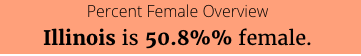
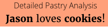
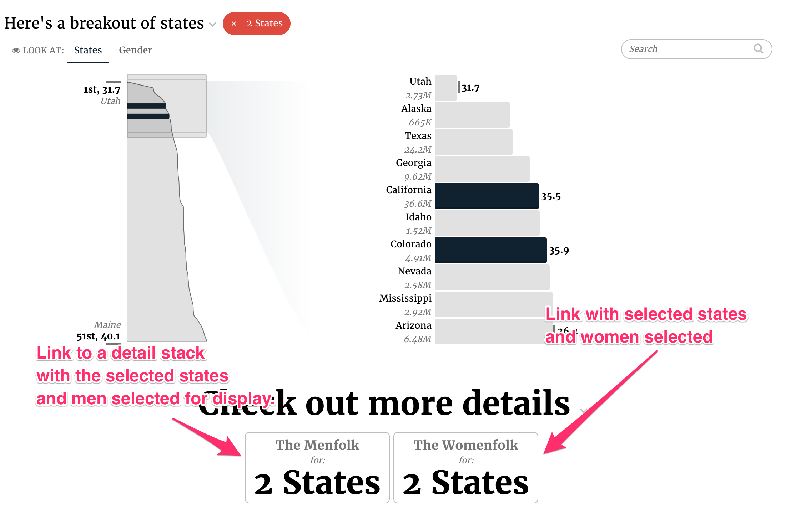
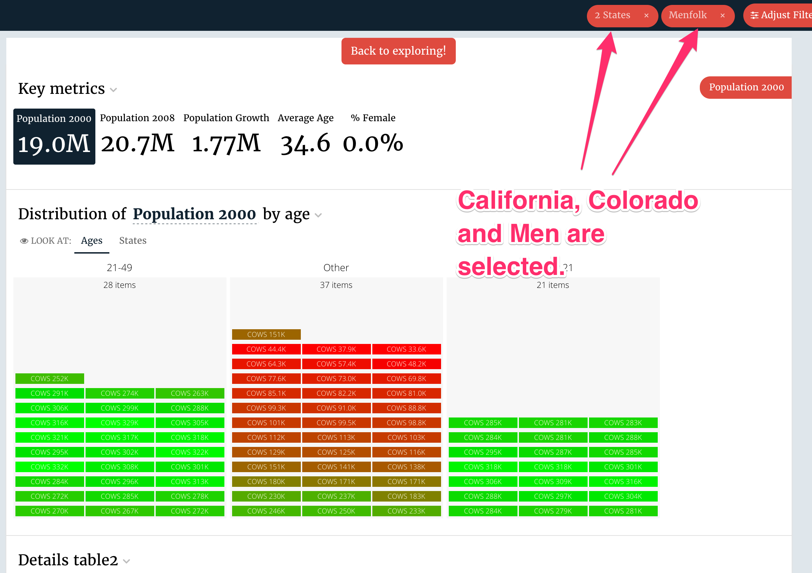
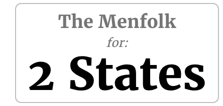

# Free Form \(done\)

## Free Form config

FreeForm slices support the [common configuration options for all slices](../slices/slices-and-common-configuration.md). Additional options are:

```text
config:
  contentTemplate: #free-form-tee-template
```

| Key | Optional | Value | Description |
| :--- | :--- | :--- | :--- |
| contentTemplate | No, without the template the slice would be empty | CSS Selector | Name of the template that will be rendered into the body-slice-template. Free form slice does not have a plugin, this template is the main source of visual in the slice. |


If your Free Form slice doesn’t require any data at all, you can omit the `data_service` config option. An empty data service will be generated and the `WithNoData` mixin will be applied to your slice so it doesn’t show the no data message.


## Flavors of Free Form

### Default \(freeform\)

By their nature free form will only have a default flavor. It creates a response that contains all the metrics and dimensions by their name; however, if there are multiple rows in the response, it will append a row number to the name. For example, if you use pop2000 a metric and run a query that returns 3 results, you will get a result that has pop2000, pop2000\_2, and pop2000\_3.



The code for the default flavor looks as follows:



```python
class FreeFormV3Service1(CensusService):
    def build_response(self):
        self.metrics = ('pctfemale', )
        self.dimensions = ('state',)
        recipe = self.recipe().metrics(*self.metrics).dimensions(
            *self.dimensions).limit(1).apply_global_filters(False)
        self.response['responses'].append(recipe.render())
```



```yaml
- slice_type: "free-form"
  slug: "jam-free-form1"
  style:
  - "title-large"
  bare: true
  mixins:
  - options: {}
    target: "view"
    class: "WithNoData"
  config:
    baseTemplateName: "#base-slice-bare-template"
    contentTemplate: "#jam-free-form1-template"
  data_service: "census_v2_service.FreeFormV3Service1"
```



```markup
<script type="text/template" id="jam-free-form1-template">
    <div style="text-align: center; margin-top: 50px; background-color: lightsalmon;">
        <div class="free-form-header">Percent Female Overview</div>
        <div class="fr-headline" style="display:inline-block; font-size: 20px">
            <div class=""><strong><%= datum.state %></strong> is <strong><%= datum.format("pctfemale", ",.1%") %></strong> female.</div>
        </div>
    </div>
</script>
```



## Free Style \(No Flavor\)

So if you want to go completely custom, you can also build a response completely from scratch.



The code for the free style flavor could looks as follows:



```python
class FreeFormV3Service2(CensusService):
    def build_response(self):
        data = {'name': 'Jason', 'pastry': 'cookies'}

        response = self.response_template()
        response['data'][0]['values'].append(data)

        self.response['responses'].append(response)
```



```yaml
- slice_type: "free-form"
  slug: "jam-free-form2"
  style:
  - "title-large"
  bare: true
  mixins:
  - options: {}
    target: "view"
    class: "WithNoData"
  config:
    baseTemplateName: "#base-slice-bare-template"
    contentTemplate: "#jam-free-form2-template"
  data_service: "census_v2_service.FreeFormV3Service2"
```



```markup
<script type="text/template" id="jam-free-form2-template">
    <div style="text-align: center; margin-top: 50px; background-color: lightsalmon;">
        <div class="free-form-header">Detailed Pastry Analysis</div>
        <div class="fr-headline" style="display:inline-block; font-size: 20px">
            <div class=""><strong><%= datum.name %></strong> loves <strong><%= datum.pastry %></strong>!</div>
        </div>
    </div>
</script>
```



## Linking to other stacks with the switch\_stacks flavor

The freeform slice allows you to jump to another stack. When you jump to another stack you need to decide whether you want to carry the current selections over to the new stack.

Let’s look at the example `switchdemo` app. It has a ranked-list slice followed by a freeform slice. When you choose one of the two buttons at the bottom you will go to the `Detail` stack. Anything you’ve selected in global filters or in the ranked list will be selected when you load the `Detail` stack.



Here’s what it looks like when you click the “The Menfolk” button.



**What does the code look like?**



```yaml
- slice_type: "free-form"
  slug: "stack_switcher_free_form"
  title: "Check out more details"
  style:
  - "title-large"
  extra_css: |-
    .slice-body__visualization {
      text-align: center;
      }
  config:
    "contentTemplate": "#stack-switcher-template"
  data_service: "explore_service.StackSwitcherService"
```



The stack switcher template defines the look of the button.



`COOKIES` is the slug of the ranked list. We love cookies so much sometimes we have to shout.



```markup
<script type="text/template" id="stack-switcher-template">
  <button type="button" class="fr-btn fr-btn-light" data-widget="action-widget">
    <div class="fr-title"><%= datum.label %></div>
    <div class="fr-caption">for:</div>
    <div class="fr-display2"><%= COOKIES.selectionDisplay() %></div>
  </button>
</script>
```



The data service looks like this



```python
def build_response(self):
    # Make a copy of the automatic filters
    menfilters = deepcopy(self.automatic_filters)
    # Set an additional filter to limit to sex='M'
    menfilters['sex'] = ['M']

    # Do the same for women
    womenfilters = deepcopy(self.automatic_filters)
    womenfilters['sex'] = ['F']

    choices = [
        {'label': 'The Menfolk',
         'app': 'switchdemo',
         'stack': 'detail',
         'filters': menfilters},

        {'label': 'The Womenfolk',
         'app': 'switchdemo',
         'stack': 'detail',
         'filters': womenfilters}
    ]

    # There is no recipe!
    # We have to create a renderer directly then tell it to render
    # with the choices we've defined.
    renderer = FreeFormRenderer(self, None, 'No name')

    response = renderer.render(flavor='switch_stacks', render_config={
        'choices': choices
    })
    self.response['responses'].append(response)
```



If you’re carrying over selections from global filters that use widgets, you’ll need to tell the renderer which selections are from the widget. This is so that the selections can be formatted appropriately in the hash.

In it’s simplest form, you pass the filters as a dictionary where the key is the `group_by_type` of the filter and the value is a list of ids of the selected items:

```text
filters = deepcopy(self.automatic_filters)
filters['sex'] = ['F']
```

To let the renderer know that the selection is from a widget, you pass the filters like this:

```text
filters = deepcopy(self.automatic_filters)
filters['sex'] = {
    'selection': ['F'],
    'widget': True
}
```

You can also pass the above structure if the global filter is not using a widget.

```text
filters = deepcopy(self.automatic_filters)
filters['sex'] = {
    'selection': ['F']
}
```

In addition to carrying over filters, its also possible to carry over selections for slices across stacks. Create a dictionary and for each slice whose selections needs to be set, add it’s `slug` to that dictionary along with the selections. The data service looks like this:



```python
def build_response(self):
    # Make a copy of the automatic filters
    menfilters = deepcopy(self.automatic_filters)
    # Set an additional filter to limit to sex='M'
    menfilters['sex'] = ['M']

    # Do the same for women
    womenfilters = deepcopy(self.automatic_filters)
    womenfilters['sex'] = ['F']

    # Select "Avg age" as the metric in the option chooser on the Details stack.
    # `foo` is the slug of the Option Chooser slice on the Details stack.
    # `metric` is the `group_by_type` of the selection.
    slice_selections = {
        'foo': {
            'selection': {'metric': self.custom_filters['metric']}
        }
    }

    choices = [
        {
         'label': 'The Menfolk',
         'app': 'switchdemo',
         'stack': 'detail',
         'filters': menfilters,
         'slices': slice_selections
        },

        {
         'label': 'The Womenfolk',
         'app': 'switchdemo',
         'stack': 'detail',
         'filters': womenfilters,
         'slices': slice_selections
        }
    ]

    # There is no recipe!
    # We have to create a renderer directly then tell it to render
    # with the choices we've defined.
    renderer = FreeFormRenderer(self, None, 'No name')

    response = renderer.render(flavor='switch_stacks', render_config={
        'choices': choices
    })
    self.response['responses'].append(response)
```



To collapse slices that can be collapsed \(i.e. `collapsable` is `True`\) pass the `collapsed` flag. And to select a response set of a slice, pass the `dataSetName` flag, like this:



```python
def build_response(self):
    # Make a copy of the automatic filters
    menfilters = deepcopy(self.automatic_filters)
    # Set an additional filter to limit to sex='M'
    menfilters['sex'] = ['M']

    # Do the same for women
    womenfilters = deepcopy(self.automatic_filters)
    womenfilters['sex'] = ['F']

    # `foo` is the slug of the Option Chooser slice on the Details stack.
    # `distribution1` is the slug of the Distribution slice on the Details stack.
    slice_selections = {
        'foo': {
            'collapsed': True
        },
        'distribution1': {
            'dataSetName': 'Ages'
        }
    }

    choices = [
        {
         'label': 'The Menfolk',
         'app': 'switchdemo',
         'stack': 'detail',
         'filters': menfilters,
         'slices': slice_selections
        },

        {
         'label': 'The Womenfolk',
         'app': 'switchdemo',
         'stack': 'detail',
         'filters': womenfilters,
         'slices': slice_selections
        }
    ]

    # There is no recipe!
    # We have to create a renderer directly then tell it to render
    # with the choices we've defined.
    renderer = FreeFormRenderer(self, None, 'No name')

    response = renderer.render(flavor='switch_stacks', render_config={
        'choices': choices
    })
    self.response['responses'].append(response)
```



