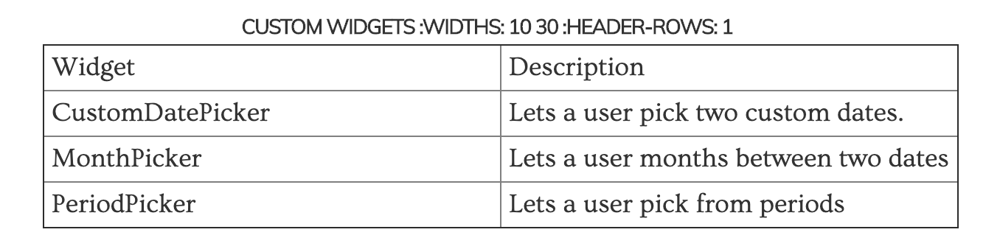

# Defining and Configuring Global Filters \(not done. don't know enough about custom widgets to fix the

A `FilterService` is used to define the filters that will be applied globally, and is a special type of data service. It is visible in the upper right hand corner of the Juicebox stack UI. FilterServices should inherit from the RecipeService you created in the prior section. Also, FilterServices should always use the `self.automatic_filter_keys` in their implementations. FilterServices are often implemented differently from a slice data service. We start by defining them in the `stack.yaml` file.

## Defining Global Filters

In the `stack.yaml` file, there is a `global_filters_service` that needs to point to the data service class in our stack’s python module or a json file found in the fixtures directory.

For example to use the `FilterService` class found in the `basicservice.py` file:



```yaml
global_filters_service: "basicservice.FilterService"
```



## Creating a Data Service

Data services power all the slices and visualizations as well as the global filters used through out our stack. Every data service uses one or more recipes to build the response that is needed by the slice. As we mentioned earlier, recipes are a way of defining how we get and use data in our data service and slice. All recipes use selected metrics, dimensions, and filters to retrieve data from the database. In most cases, recipes can also render a response themselves for your slice. However, it is also possible to build a custom response as well using the data returned from a recipe. Let’s begin with filter services.

For every service that we build, we have to define a `build_response` method that specifies how we return data to the visualization slice. This is done by building one or more recipes to get the data, and then using the `.render('NAME')` method on the recipe that can generate a response to be returned to the UI as JSON for use in the filters.

Example of a single global filter and recipe:



```python
class FilterService(CensusService):
    def build_response(self):
        self.metrics = ('pop2000', )
        recipe = self.recipe().metrics(*self.metrics).dimensions(
            *self.automatic_filter_keys)

        self.response['responses'].append(recipe.render('State'))
```



Often, you will want to have multiple global filters. To do this you build a recipe using each dimension for which you want a filter. Then you can append the result from each `recipe.render()` to the response; however, we also have another feature called a RecipePool that can take a list of recipe details and build a response. Each recipe detail is a tuple that contains the recipe, name, and optionally a flavor. We’ll talk more about flavors in a bit.

Example of multiple global filters and recipes:



```python
class FilterService(CensusService):
    def build_response(self):
        self.metrics = ('pop2000', )
        recipes = []
        for dim in self.automatic_filter_keys:
            recipe = self.recipe().metrics(*self.metrics).dimensions(dim)
            recipes.append((recipe, dim))

        results = RecipePool(recipes).run()
        self.response['responses'] = results
```



When using the `refresh` yaml config setting, the recipe has to have `.exclude_automatic_filter_keys(dimension)` added to the recipe for each dimension in the global filters:



```python
for dim in {list of global filters}:
  recipe = self.recipe().dimensions(dim).metrics(*metrics).exclude_automatic_filter_keys(dim)
```



## Global Filter Configurations and Options

Global filters are configured using `filters_config` in `stack.yaml`. Configuration looks like this:



```text
filters_config:
  global:
    defaultSort: "name"
  "audit_quarter":
    maxSelections: 1
  "facility":
    maxSelections: 1
```



The global filters can be configured on a per-stack basis. A special config key called `global` is used to specify configuration that is common across all the filters.

### Sorting Configurations

The sorting configs are not specific to any particular filter and are applied across all of them. The refreshing of the filters is also controlled by a single option available under “global” called “refresh”. Sometimes users may make filter selections that are ineligible or narrow down the data greatly, causing very little data to show in their slices. Enabling the “refresh” config avoids this scenario by filtering down to eligible remaining global filter options.

<table>
  <thead>
    <tr>
      <th style="text-align:left">
        <p></p>
        <p>Option</p>
      </th>
      <th style="text-align:left">Description</th>
    </tr>
  </thead>
  <tbody>
    <tr>
      <td style="text-align:left"><code>defaultSort</code>
      </td>
      <td style="text-align:left">Can either be &#x201C;name&#x201D; or &#x201C;count&#x201D;.</td>
    </tr>
    <tr>
      <td style="text-align:left"><code>defaultSortDirection</code>
      </td>
      <td style="text-align:left">Use -1 for descending and 1 for ascending.</td>
    </tr>
    <tr>
      <td style="text-align:left"><code>disableSort</code>
      </td>
      <td style="text-align:left">true/false to turn off sorting. The default is sorting is enabled.</td>
    </tr>
    <tr>
      <td style="text-align:left"><code>refresh</code>
      </td>
      <td style="text-align:left">true/false to indicate if the filters should refresh themselves when selections
        change.</td>
    </tr>
    <tr>
      <td style="text-align:left"><code>filterLabel</code>
      </td>
      <td style="text-align:left">Can be any string to override labelling filters as &#x201C;Filters&#x201D;</td>
    </tr>
  </tbody>
</table>For `refresh` config, see note in Creating a Data Service above.

An example:

```text
filters_config:
  global:
    "defaultSort": "name"
    "defaultSortDirection": -1
    "disableSort": false
    "refresh": true
```

### Per-Filter Configurations

The following config properties can be specified on a per filter basis. Use the filter’s `group_by_type` property as the key.

| Option | Description |
| :--- | :--- |
| `minSelections` | The minimum number of selections required for this filter. This value will be used to automatically select those many items if they aren’t already. Defaults to 0. |
| `maxSelections` | The maximum number of selections allowed for this filter. Defaults to the maximum numeric value representable in JavaScript \(approximately 1.79E+308\). |
| `filterTemplateName` | A name of a template that would be used to render **all** the items in that filter. |

An example:



```text
{group_by_type}:
    minSelections: 0
    maxSelections: 1
    filterTemplateName: "#mooTemplate"
```



## Custom Widgets

It is possible to render individual filter items using a custom widget. **The only custom widget that is currently supported is a date picker.** Custom widgets require custom backbone views to be built so instead of going down this path, you might want to check if just a custom template might work for you \(`filterTemplateName`\).

Custom Widgets are specified on an individual filter item \(so the data service would have to supply this\) via the `widget` property. You can also supply any options for that widget using the `widgetOptions` property.

For example, consider you have a “Date” global filter with the following items: “This Year”, “Last 3 months”, “Last month”. It’s data response would look like:



```text
"items": [
  {
    "count": 1,
    "group_by_type": "date",
    "id": "thisyear",
    "name": "This Year",
    "subtitle": "Jan 1, 2014 - Dec 31, 2014"
  },
  {
    "count": 1,
    "group_by_type": "date",
    "id": "last3",
    "name": "Last three months",
    "subtitle": "Jan 1, 2015 - March 31, 2015"
  },
  {
    "count": 1,
    "group_by_type": "date",
    "id": "lastmonth",
    "name": "Last month",
    "subtitle": "March 1, 2015 - March 31, 2015"
  }
]
```



If you wanted to add a fourth item - a custom date picker - you would be able to do it by adding a new item and giving it an attribute called `widget` which indicates the widget used to render it. Like so:



```text
{
  "count": 1,
  "group_by_type": "date",
  "id": "custom",
  "name": "custom",
  "widget": "CustomDatePicker",
  "widgetOptions":  {},   // Potential widget options.
}
```



The selection from this filter will look like `mm/dd/yyyy-mm/dd/yyyy`. So, the example above would generate `date = mm/dd/yyyy-mm/dd/yyyy`.

### Custom Widget Caveats


> * The global filters will switch to using the SlickGrid component to render a list of filter items if the number of items &gt; 50. The date picker widget is setup to work with the SlickGrid component, but due to SlickGrid’s re-rendering it causes a bunch of flicker. Please avoid using a custom widget for a filter item if the filter has &gt; 50 items.
> * In the future, the code might be updated to not use the SlickGrid component for a filter if any of its items are using a custom widget.


Three custom widgets currently exist



## Handling Dates

## Custom Templates

```text
{
    "{group_by_type}": {
        "filterTemplateName": "#mooTemplate"
    }
}
```

## Filter Widgets

[https://github.com/juiceinc/fruition/pull/50](https://github.com/juiceinc/fruition/pull/50)

