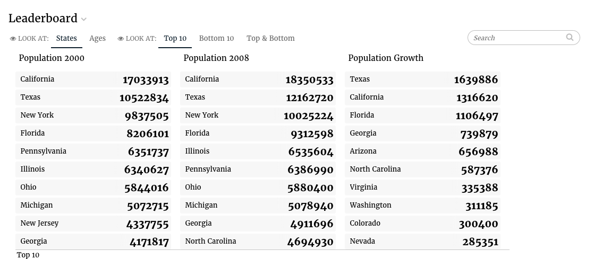

# Leaderboard \(done\)

## Leaderboard config

Leaderboard slices support the [Common configuration options for all slices](../slices/slices-and-common-configuration.md). Additional options are:



```yaml
config:
  columns: [{“name”: “student_name”,”searchable”: false,”reverse”: false, “format”: “”}, {…}, …]
  ignoreNulls: false
  showMode: both
  numberOfRows: 20
```



| Key | Optional | Values | Description |
| :--- | :--- | :--- | :--- |
| columns | Yes, but results might be unexpected \(might pick the wrong name column\) if columns not defined | An array of `{name,searchable,reverse}` objects | An array of column descriptions \(in the order they need to be displayed in leaderboard\). Each cell in Leaderboard consists of a Name and a Value of \(eg. \[StudentX 99\] \[StudentZ 23\]\). The name field for each cell should be specified as the first item in columns array. The first column \(name field\) will not be rendered in leaderboard, its field value rather becomes the name part in each cell. Your first column is NOT an ID or a numeric value, it should be a property name in each data item that has a string value. Value fields should be specified next, in the order they need to appear in the leaderboard. |
| ignoreNulls | Yes, defaults to true \(will be ignored\) | Boolean | Should the `null` values be ignored? |
| showMode | Yes, defaults to top | top\|bottom\|both | Which records should leaderboard initially show? Top X? Bottom X? or Top X/2 and Bottom X/2? |
| numberOfRows | Yes, defaults to 10 | Integer | Number of rows displayed in leaderboard. |

## Flavors of Leaderboard

### Default \(leaderboard\)

The default flavor renders a many metrics and dimensions grouped by a single dimension. The primary dimension is used as the grouping dimension.



The code for the default Trend flavor looks as follows for rendering multiple datasets:



```python
class LeaderboardV3Service(CensusService):
    def build_response(self):
        self.metrics = ('pop2000', 'pop2008', 'popdiff')
        self.dimensions = ('state', )
        recipe1 = self.recipe().metrics(*self.metrics).dimensions(
            *self.dimensions)
        self.dimensions = ('age', )
        recipe2 = self.recipe().metrics(*self.metrics).dimensions(
            *self.dimensions)

        results = RecipePool([
            (recipe1, 'States'), (recipe2, 'Ages'),
        ]).run()
        self.response['responses'] = results
```



```yaml
- slice_type: "leaderboard"
  slug: "leaderboard"
  title: "Leaderboard"
  data_service: "some_service.LeaderboardV3Service"
```



