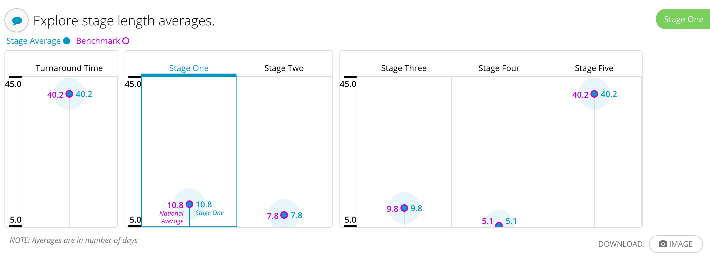
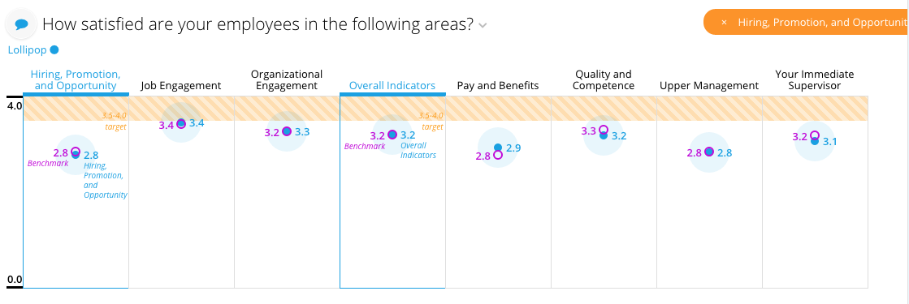
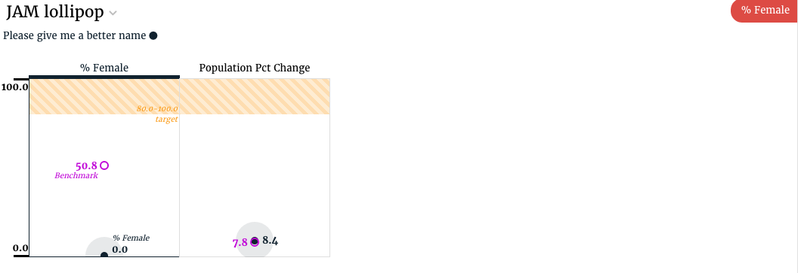

# Lollipop \(done\)

## Lollipop config

Lollipop slices support the [common configuration options for all slices](../slices/slices-and-common-configuration.md). Additional options are:



```text
config:
  blockWidthRange: 50
  showGroupTitle: false
  showStick: true
  groups:
    group_a:
      max: 100
      min: 0
      showScales: true
  itemLinks:
      overall_score: compliance/overall
      knowledge_score: compliance/knowledge
```



| Key | Optional | Values | Description |
| :--- | :--- | :--- | :--- |
| blockWidthRange | Yes, if it is not defined, lollipop section widths become dynamic | An array of two integers: \[min, max\] number | Lollipop section \(container of a single lollipop\) preferred width range in pixels |
| showGroupTitle | Yes, default is true | Boolean | Indicates whether the group title should be displayed |
| showStick | Yes, default is false | Boolean | Displays/hides the main lollipop’s stick \(the one that connects base line to the point\) |
| groups | Yes, default is: min/max are dynamic, showScales is `true` | JS Object | Defines min\|max\|showScales for each lollipop group \(group name is the `key`\). You can set a default for all groups by specifying `default` as the key. |
| itemLinks | Yes | JS Object | Use only with `LollipopLinkableItemsViewMixin`, which enables URL navigation on lollipop clicks. `itemLinks` object is a map with the key \(the id of an lollipop item\) and the value \(the url this item links to\) |

## Flavors for Lollipop

### Default \(lollipop\)

The default flavor provides the most flexible behavior. The default flavor is used when you have a flat structure with a list of metrics across a \(possible\) single dimension with a comparison recipe. Typically one or two rows are in the results. A lollipop segment is rendered for every metric. It accepts a render\_config object with various options passed in.

The default flavor, with no render\_config provided would look something like:



```python
class LollipopV3Service(CensusService):
    def build_response(self):
        self.metrics = ('pctfemale', 'pctdiff')
        benchmark = self.recipe().dimensions().metrics(
            *self.metrics).apply_global_filters(False)

        recipe = self.recipe().metrics(*self.metrics).dimensions(
            *self.dimensions).apply_global_filters(True).filters(
            *self.filters).compare(benchmark)

        self.response['responses'].append(recipe.render())
```



```yaml
- slice_type: "lollipop"
  slug: "lollipop"
  title: 'How satisfied are your employees in the following areas?'
  data_service: "lollipop_data_services.LollipopService"
```



It is possible to supply a separate set of comparison metrics for the benchmark. In order to do this, the comparison metrics must be supplied to the benchmark recipe, and the list of metrics and comparison metrics must be supplied via a `render_config` dictionary. Additionally, when supplying comparison metrics, an empty suffix must be passed as an argument in the compare method. For example, in the code block below, the benchmark recipe uses separate national averages.



```python
class LollipopService(OverviewService):
    def build_response(self):
        self.metrics = ('turnaround_avg', 'stage_1_avg', 'stage_2_avg',
                        'stage_3_avg', 'stage_4_avg', 'stage_5_avg')

        comparison_metrics = ('national_tat_avg', 'national_1_avg',
                              'national_2_avg', 'national_3_avg',
                              'national_4_avg', 'national_5_avg')

        benchmark = self.recipe().metrics(*comparison_metrics)\
            .apply_global_filters(False)

        recipe = self.recipe().metrics(*self.metrics).compare(benchmark,
                                                              suffix='')

        render_config = {
            'metrics': ['turnaround_avg', 'stage_1_avg', 'stage_2_avg',
                        'stage_3_avg', 'stage_4_avg', 'stage_5_avg'],
            'comparison_metrics': ['national_tat_avg', 'national_1_avg',
                                   'national_2_avg', 'national_3_avg',
                                   'national_4_avg', 'national_5_avg'],
        }
```



It is also possible to override the default comparison label and target range by supplying a `render_config` dictionary to the `render()` method. For example, the code below will change the shaded target band to range from 3.7 to 4.1 and change the word Benchmark to Cookies in the displayed output.



```python
class LollipopV3Service(CensusService):
    def build_response(self):
        self.metrics = ('pctfemale', 'pctdiff')
        benchmark = self.recipe().dimensions().metrics(
            *self.metrics).apply_global_filters(False)

        recipe = self.recipe().metrics(*self.metrics).dimensions(
            *self.dimensions).apply_global_filters(True).filters(
            *self.filters).compare(benchmark)

        render_config = {
            'target': [3.7, 4.1],
            'comparison_label': 'Cookies'
        }
        self.response['responses'].append(
            recipe.render(flavor='single_benchmark',
                          render_config=render_config)
        )
```



In order to separate the lollipops into groups, a list of groups and the metrics associated with each group must be supplied as a part of the `render_config` dictionary. The renderer expects the groups to be a list of lists, where the first item in the group is the name of the group, and the second item is a list of the metrics in that group. If no groups are supplied in `render_config`, the renderer will create a default group, using all of the metrics in the recipe. For example, the code block below will create three groups \(the two groups listed, and a third group that uses the remaining metrics not used with other groups\).





```text
class LollipopV3Service(OverviewService):
    def build_response(self):
        self.metrics = ('turnaround_avg', 'stage_1_avg', 'stage_2_avg',
                        'stage_3_avg', 'stage_4_avg', 'stage_5_avg')

        benchmark = self.recipe().metrics(
            *self.metrics).apply_global_filters(False)

        recipe = self.recipe().metrics(
            *self.metrics).apply_global_filters(True).compare(benchmark)

        render_config = {
            'groups': [
                ['turnaround_lollipop', ['turnaround_avg']],
                ['stage_1_and_2', ['stage_1_avg', 'stage_2_avg']]
            ]
        }
```



### Single Dimension \(lollipop\)

The single dimension flavor is used when you want a lollipop slice for each distinct value of a single dimension for a single metric with a comparison recipe. Typically multiple rows are in the results.



The code for the single dimension flavor looks as follows:



```python
class LollipopService(EIService):
    def build_response(self):
        self.metrics = ['c_meanscore', 'c_db_meanscore']
        benchmark = self.recipe().metrics(*self.metrics).dimensions()

        self.dimensions = ['category']
        recipe = self.recipe().metrics(*self.metrics).dimensions(
            *self.dimensions).order_by('category').compare(benchmark)

        self.response['responses'].append(
            recipe.render('Lollipop', flavor='single_dimension'))
```



```yaml
- slice_type: "lollipop"
  slug: "lollipop"
  title: 'How satisfied are your employees in the following areas?'
  config:
    style:
    - "section-content"
    "defaultToggleItem": {"id": "", "label": ""}
    "showGroupTitle": false
    "groups":
      "default":
        "max": 4
    "showStick": true
    mixins:
      "options": {}
      "target": "view"
      "class": "WithFilterChange"
  data_service: "lollipop_data_services.LollipopService"
```



### Single Benchmark \(lollipop\)

The single benchmark flavor is used when you have a flat structure with a list of metrics across a single dimension with a comparison recipe. Typically one or two rows are in the results. A lollipop segment is rendered for every metric.



The code for the single benchmark flavor looks as follows:



```python
class LollipopV3Service(CensusService):
    def build_response(self):
        self.metrics = ('pctfemale', 'pctdiff')
        benchmark = self.recipe().dimensions().metrics(
            *self.metrics).apply_global_filters(False)

        recipe = self.recipe().metrics(*self.metrics).dimensions(
            *self.dimensions).apply_global_filters(True).filters(
            *self.filters).compare(benchmark)

        self.response['responses'].append(
            recipe.render(flavor='single_benchmark'))
```



```yaml
- slice_type: "lollipop"
  slug: "lollipop-jam1"
  title: "JAM lollipop"
  config:
    "groups":
      "default":
        "max": 100
    "minSelections": 1
    "showStick": true
  data_service: "lollipop_data_services.LollipopV3Service"
```



