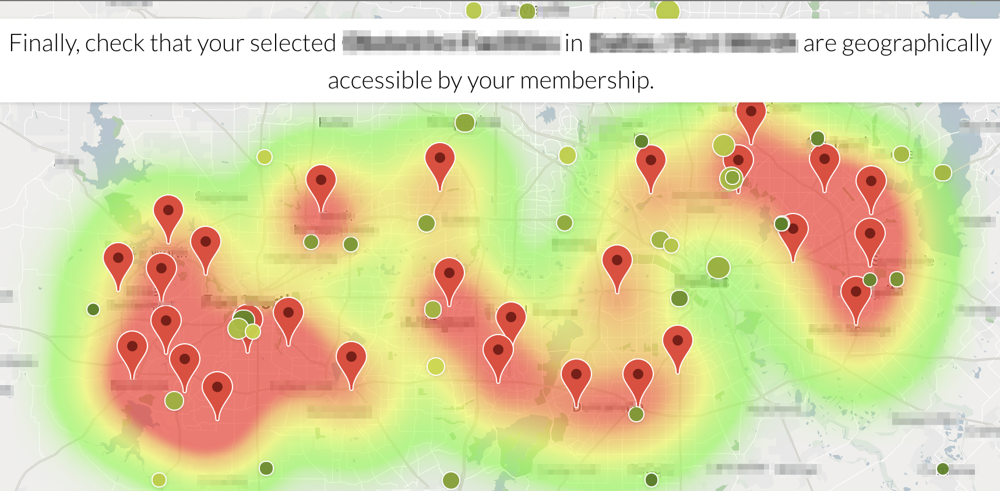

# Map \(done\)

With the recent addition of a heatmap layer, a map can display the big picture of what data looks like using a translucent color gradient to indicate data item density. The marker layer can be enabled to display specific data items on the map, and easily compare heatmap data with marker data.

## Map config

Map slices support the [common configuration options for all slices](../slices/slices-and-common-configuration.md). Additional options are:



```yaml
config:
  colors: [{"range":["#FFF","#1a8cdb"],"domain":[null,90],"name":"score"}]
  maxZoom: 7
  minZoom: 6
  sizes: [{"range":[20, 50],"domain":[null,90],"name":"score"}]
  styles: [{...}]
  tooltipTemplateName: #map-slice-tooltip-compliance-template
  layers:
    heatmap:
      radius: 20
    markers:
      selectable: false
```



| Key | Optional | Values | Description |
| :--- | :--- | :--- | :--- |
| colors | Yes | an array of `{name, domain[min,max], range[min,max]}` objects | Defines the color \(domain/range\) of the bubbles on the map. It is an array of ```{`name, domain[min,max], range[min,max]}`` objects, where `name` is a data object field used to color the bubble; min/max in domain can be `null`, which makes it dynamic and derive those values from data |
| maxZoom | Yes, default is 8 | Integer between 1-10 | Maximum zoom level in map. Should be a number between 1 and 10 \(from Google Maps API\) |
| minZoom | Yes, default is 4 | Integer between 1-10 | Minimum zoom level in map. Should be a number between 1 and 10 \(from Google Maps API\) |
| sizes | Yes | an array of `{name, domain[min,max], range[min,max]}` objects | Defines the sizes \(domain/range\) of the bubbles on the map. It is an array of `{name, domain[min,max], range[min,max]}` objects, where `name` is a data object field used to size the bubble; min/max in domain can be `null`, which makes it dynamic and derive those values from data |
| heatmap | Yes | All options found in the Google Maps Api linked above can be specified to configure the heatmap.  | If the heatmap is configured, map coloring will show the density of data items in various areas of the map. Heatmaps cannot be filtered. Options are found [here](https://developers.google.com/maps/documentation/javascript/reference/visualization#HeatmapLayerOptions). In the example above, we use `radius`, which can be set to the number of pixels that should be filled in around a data item, shown below. |
| markers | Yes | All options enumerated in the Google Maps API MarkerOptions are available.  | Markers will appear on the map with the provided options. Markers cannot be filtered. Available options specified in the Google Maps API[ here](https://developers.google.com/maps/documentation/javascript/reference/marker#MarkerOptions). A common option is `selectable`, displayed in the example above. It defaults to true, but can be set to false to display markers that cannot be interacted with by the user. |

## Flavors of Map

### Default

Recipes should have three dimensions.

| Dimensions | What's in it |
| :--- | :--- |
| Dimension1: | The group\_by\_type and name of the map bubbles. |
| Dimension2: | The latitude of map bubbles. |
| Dimension3: | The longitude of map bubbles. |

Recipes should have at least two metrics.

| Metrics | What's in it |
| :--- | :--- |
| Metric1: | The `count` property, typically used to size map bubbles.  |
| Metric2: | The `score` property, typically used to color map bubbles. |

Any additional metrics provided will appear in each response row.

Here's an example:



```python
class MapService(JuiceboxServiceBase):
    data_source = 'uscities'

    def build_response(self):
        metrics = ('ranking', 'population', )
        dimensions = ('city', 'lat', 'lng')

        recipe = self.recipe().metrics(*metrics).dimensions(*dimensions)
        response = recipe.render(name="Cities")
        self.response['responses'].append(response)
```



### Heatmap

The heatmap flavor returns data that is then configured in the stack to display as a colored gradient on the map. It can be configured similarly to default, but cannot include filters.

### Marker

The marker flavor returns data that is configured in the stack to display a series of markers on each specific pinpoint returned. It can be configured similarly to default, but cannot include filters.

## Advanced Map Examples

Sometimes, a dataset will be best represented with a map that contains a combination of the default, heatmap, and marker flavors. For instance, the heatmap can be used to represent club members, and the markers to represent club meeting locations, making it easy to visually identify an under-served section of the membership.



This can be accomplished using a series of renders in the data service.

Since this complex map is built out of multiple flavors, the responses are merged using `append_response_item_collections` before return, like so:



```python
def build_response(self):
  recipe = self.recipe().metrics(*metrics)\
      .dimensions(*dimensions)\
      .filters(*filters)
  club_region = self.automatic_filters['club_region']
  heatmap = self.recipe().metrics(*club_metrics)\
      .dimensions(*club_dimensions)\
      .include_automatic_filter_keys('club_region')
  heatmap_rendered = heatmap.render(flavor='heatmap')

  marker = self.recipe().metrics(*member_metrics)\
      .dimensions(*member_dimensions)\
      .include_automatic_filter_keys('member_region')
  marker_rendered = marker.render(flavor='marker')
  joined = append_response_item_collections(recipe.render(),
                                            heatmap_rendered,
                                            'heatmap',
                                            marker_rendered,
                                            'marker')
  self.response['responses'].append(joined)
```



