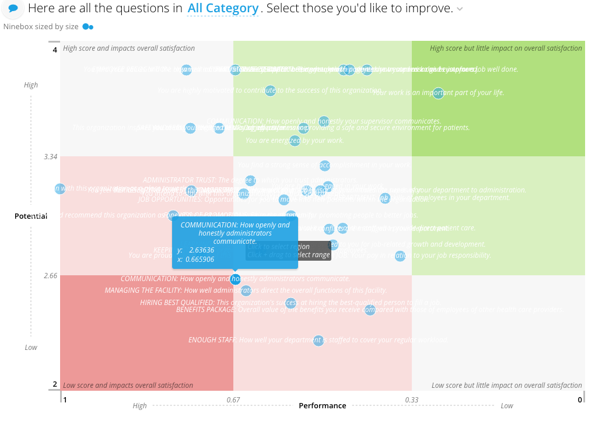
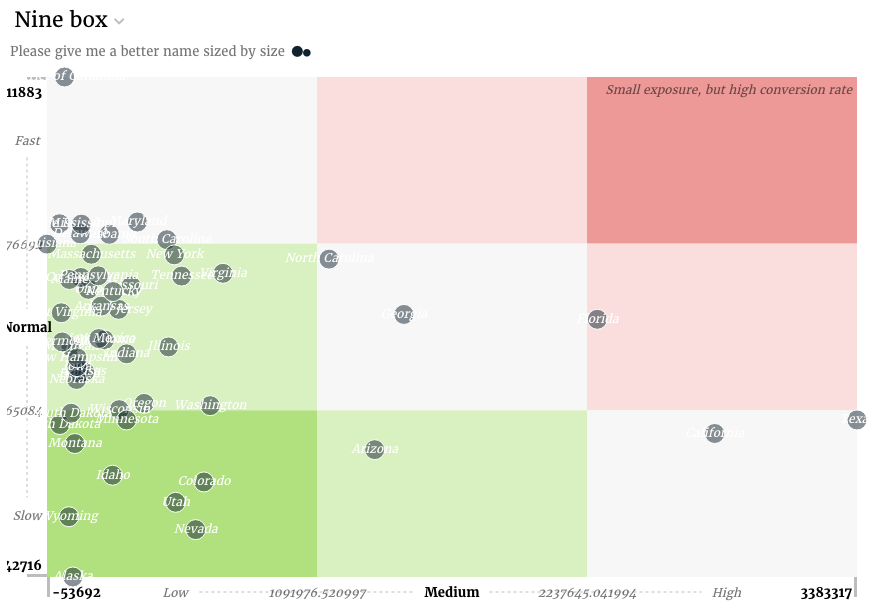

# Nine Box

## Nine box config

Nine box slices support the [common configuration options for all slices](../slices/slices-and-common-configuration.md). Additional options are:

### axisLabels \(nine box\)

Name of the X and Y labels

| Optional: | Yes. |
| :--- | :--- |
| Values: | An array of {labels: \[\]} objects. the first object refers to X axis, the second object refers to Y axis |
| Example: |  |

### boxLabels

An array of labels that should be displayed inside the box/regions. You can set the position the label should be displayed in the box

| Optional: | Yes. |
| :--- | :--- |
| Values: | An array of {position \(n\|ne\|e\|se\|s\|sw\|w\|nw\),row,col,text} objects |
| Example: |  |

### h\_lines \(nine box\)

Horizontal line boundaries

| Optional: | Yes, default is \[“33.3333%”, “33.3333%”\] |
| :--- | :--- |
| Values: | Array of widths between boundaries \(eg. \[“33.3333%”, “33.3333%”\] will make three equally spaced regions: 0%-33%, 33%-66%, 66%-100% of the width\) |
| Example: |  |

### height \(nine box\)

The height of the visual component

| Optional: | Yes, default is 500 |
| :--- | :--- |
| Values: | number \(in pixels\) |
| Example: |  |

### invertXAxis \(nine box\)

Should the X axis be inverted? eg. if \[0-100\] is inverted, 100 will appear asthe leftmost point and 0 will be the rightmost

| Optional: | Yes, default is `false` |
| :--- | :--- |
| Values: | true\|false |
| Example: |  |

### invertYAxis \(nine box\)

Should the Y axis be inverted? eg. if \[0-100\] is inverted, 100 will appear atthe bottom and 0 will be the topmost point

| Optional: | Yes, default is `false` |
| :--- | :--- |
| Values”: | true\|false |
| Example: |  |

### margins \(nine box\)

Margins of the visual component

| Optional: | Yes, default is {left: 40, bottom: 30, top: 10, right: 10} |
| :--- | :--- |
| Values: | {left, right, top, bottom} \(all numbers in px\) |
| Example: |  |

### showBoundaryLabels

Should the region boundary labels be shown?

| Optional: | Yes, default is `true` |
| :--- | :--- |
| Values: | true\|false |
| Example: |  |

### sizeMinMax

Min/max size of the bubble \(radius, in pixels\)

| Optional: | Yes, default is \[10, 10\] \(all bubbles have radius of 10px\) |
| :--- | :--- |
| Values: | array, \[min, max\] in pixels |
| Example: |  |

### v\_lines \(nine box\)

Vertical line boundaries

| Optional: | Yes, default is \[“33.3333%”, “33.3333%”\] |
| :--- | :--- |
| Values: | Array of heights between boundaries \(eg. \[“33.3333%”, “33.3333%”\] will make three equally spaced regions: 0%-33%, 33%-66%, 66%-100% of the height\) |
| Example: |  |

### width

Width of the visual component

| Optional: | Yes |
| :--- | :--- |
| Values: | number \(in pixels\) |
| Example: |  |

### x\_bounds \(nine box\)

Domain \(possible min/max\) values on X axis. Use it if your data does not reflect the full range of points you want to display on the chart \(eg. your data is within 5-20 range, when the chart should be show in 0-100\)

| Optional: | Yes, by default domain is dynamically derived from X field data |
| :--- | :--- |
| Values: | array of \[min, max\] |
| Example: |  |

### y\_bounds \(nine box\)

Domain \(possible min/max\) values on Y axis. Use it if your data does not reflect the full range of points you want to display on the chart \(eg. your data is within 5-20 range, when the chart should be show in 0-100\)

| Optional: | Yes, by default domain is dynamically derived from Y field data |
| :--- | :--- |
| Values: | array of \[min, max\] |
| Example: |  |

### searchFields \(nine box\)

The data attributes to be used for searching

| Optional: | Yes. Default is \[“label”\] |
| :--- | :--- |
| Values: | array of \[min, max\] |
| Example: |  |

## Flavors of Ninebox

### Default \(nine box\)

Due to the requirements of the Nine box, there is not a default flavor presently.

### Quad Dimensions

The quad dimensions flavor uses the first dimension as the x value and the second dimension as the y value for grid placement. It renders a label based on the third dimension and the fourth dimension is used as the GUID. The first metric will be used as the size if present.



The code for the quad dimensions flavor looks as follows:

```text
class NineBoxService(EIService):

    def __init__(self, *args, **kwargs):
        super(NineBoxService, self).__init__(*args, **kwargs)
        self.automatic_filter_keys += ('category',)

    def build_response(self):
        self.dimensions = ['correlation', 'meanscore', 'question',
                           'question_order']

        recipe = self.recipe().metrics().dimensions(*self.dimensions
            ).filters(*self.filters)

    self.response['responses'].append(recipe.render('Ninebox'))
```

The slice in stack.yaml:

```text
- slice_type: "nine-box"
  slug: "nine-box"
  title: "Here are all the questions in <strong><%= lollipop.selectionDisplay() %></strong>. Select those you'd like to improve."
  config:
      "axisLabels":
      - "labels":
        - "Low"
        - "Performance"
        - "High"
      - "labels":
        - "Low"
        - "Potential"
        - "High"
      "height": 600
      "width": 900
      "margins":
        "top": 10
        "right": 10
        "bottom": 40
        "left": 100
      "pluralCountSuffix": "questions"
      "h_lines":
        - "33"
        - "34"
      "v_lines":
        - "33"
        - "34"
      "x_bounds":
        - 0
        - 1
      "y_bounds":
        - 2
        - 4
      "invertXAxis": True
      "tooltipTemplateName": "#nine-box-tooltip-ei-template"
      "boxLabels":
        -
          position: "ne"
          row: 0
          col: 2
          text: "High score but little impact on overall satisfaction"
        -
          position: "nw"
          row: 0
          col: 0
          text: "High score and impacts overall satisfaction"
        -
          position: "se"
          row: 2
          col: 2
          text: "Low score but little impact on overall satisfaction"
        -
          position: "sw"
          row: 2
          col: 0
          text: "Low score and impacts overall satisfaction"
  data_service: "EIDataServices.NineBoxService"
```

And finally the template for the tooltips:

```text
<script type="text/template" id="nine-box-tooltip-ei-template">
    <div class="nbox-tooltip-content--line1"><%= datum.label %></div>
    <table>
        <tr>
          <td style="text-align: left;"><%= (metadata.y && metadata.y.plural) || 'y' %>:</td>
          <td style="text-align: right; padding-left: 3px;"><%= datum.format('y', (metadata.y && metadata.y.format)) %></td>
        </tr>
        <tr>
          <td style="text-align: left;"><%= (metadata.x && metadata.x.plural) || 'x' %>:</td>
          <td style="text-align: right; padding-left: 3px;"><%= datum.format('x', (metadata.x && metadata.x.format)) %></td>
        </tr>
    </table>
</script>
```

Any additional dimensions and metrics are not included in the output in anyway.

### Dual Metric

The dual metric flavor uses the first metric as the x value and the second metric as the y value for grid placement. It renders a label based on the first dimension. The third metric will be used as the size if present.



The code for the dual metrics flavor looks as follows:

```text
class NineBoxV3Service(CensusService):
    def build_response(self):
        self.metrics = ('popdiff', 'pctfemale')
        self.dimensions = ('state',)
        recipe = self.recipe().metrics(*self.metrics).dimensions(
            *self.dimensions).apply_global_filters(False)

        self.response['responses'].append(recipe.render())
```

The slice in stack.yaml:

```text
- slice_type: "nine-box"
  slug: "ninebox"
  title: "Nine box"
  config:
    "axisLabels": [{"labels": ["Low", "Medium", "High"]}, {"labels": ["Slow", "Normal", "Fast"]}]
    "boxLabels":
    - "col": 2
      "position": "ne"
      "row": 0
      "text": "Small exposure, but high conversion rate"
  data_service: "censusv2service.NineBoxV3Service"
```

Any additional dimensions and metrics are not included in the output in anyway.

