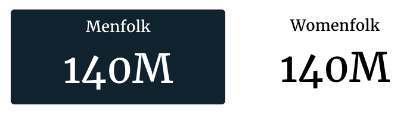
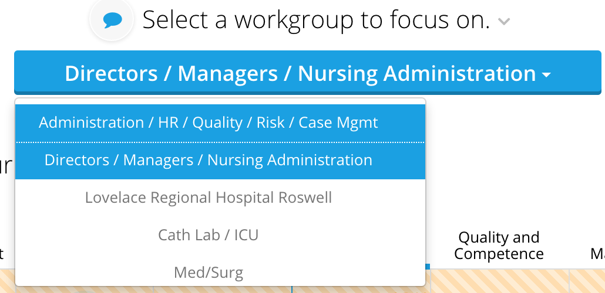
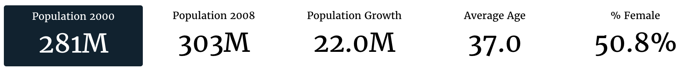
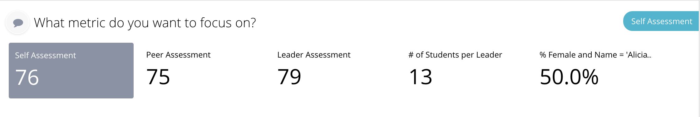
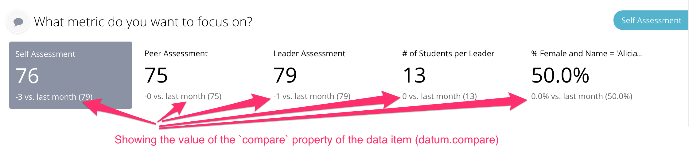
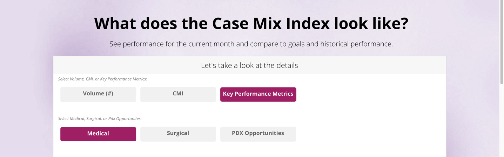

# Option Chooser

## Option chooser config

Option chooser slices support the [common configuration options for all slices](../slices/slices-and-common-configuration.md). Additional options are:

```text

```

| Key | Optional | Values | Description |
| :--- | :--- | :--- | :--- |
| groups | Yes | An object with option name as a key and {minSelections,maxSelections} properties | Overrides default option settings for specified chooser |
| hasFilterText | Yes, default is false | Boolean | Should the slice display its local filter text \(selection\). Typically, this slice does not display filter text, so it is disabled by default. You need to explicitly enable it to display filter/selection text |
| optionTemplate **DEPRECATED** - **If seen, please convert to optionTemplateName** | N/A | N/A | N/A |
| optionTemplateName | Yes, will use the default template \(see OptionChooserSliceView.js\) | CSS Selector | The name of the template for the options. **NOTE** This option is ignored when the option chooser is setup with the drop down mixin. |
| templateField | Yes | String | Name of the field in data item that refers to the template defined in template.html. Useful if data items should render different templates |
| selectorTemplate **DEPRECATED** - **If seen, please convert to selectorTemplateName** | N/A | N/A | N/A |
| selectorTemplateName | Yes, will use the default template \(see OptionChooserSliceView.js\) | CSS Selector | The name of the template for the container/selector. **NOTE** This option is ignored when the option chooser is setup with the drop down mixin. |
| showTitles | Yes, default is true | Boolean | Should the selection names be visible right in front of the selection options? |
| nonSelectedText | Yes, default is `None selected` | String | The text displayed when no option is selected |

### groups \(option chooser\)

Overrides default option settings for specified chooser

| Optional: | Yes. |
| :--- | :--- |
| Values: | An object with option name as a key and {minSelections,maxSelections} properties |
| Example: |  |

### hasFilterText

Should the slice display its local filter text \(selection\). Typically, this slice does not display filter text, so it is disabled by default. You need to explicitly enable it to display filter/selection text

| Optional: | Yes, default is ‘’false’’ |
| :--- | :--- |
| Values: | true\|false |
| Example: |  |

### optionTemplate

**Deprecated** Use `optionTemplateName` instead! The template that would be used to render options

| Optional: | Yes, default is &lt;div data-id=”&lt;%= id %&gt;” class=”group-container\_\_item”&gt;&lt;%= label %&gt;&lt;/div&gt; |
| :--- | :--- |
| Values: | “\*” |

### optionTemplateName

The name of the template for the options.

**NOTE** This option is ignored when the option chooser is setup with the drop down mixin.

| Optional: | Yes, will use the default template \(see OptionChooserSliceView.js\) |
| :--- | :--- |
| Values: | CSS selector |
| Example: |  |

### templateField

Name of the field in data item that refers to the template defined in template.html. Useful if data items should render different templates

| Optional: | Yes |
| :--- | :--- |
| Values: | String |
| Example: |  |

### selectorTemplate

**Deprecated** Use `selectorTemplateName` instead! The template that would be used to render options container/selector

| Optional: | Yes, default is &lt;div data-name=”&lt;%= name %&gt;” class=”group-container\_\_item-container”&gt;&lt;/div&gt; |
| :--- | :--- |
| Values: | “\*” |

### selectorTemplateName

The name of the template for the container/selector.

**NOTE** This option is ignored when the option chooser is setup with the drop down mixin.

| Optional: | Yes, will use the default template \(see OptionChooserSliceView.js\) |
| :--- | :--- |
| Values: | CSS selector |
| Example: |  |

### showTitles

Should the selection names be visible right in front of the selection options?

| Optional: | Yes, default is `true` |
| :--- | :--- |
| Values: | true\|false |
| Example: |  |

### nonSelectedText

The text displayed when no option is selected

| Optional: | Yes, default is `None selected` |
| :--- | :--- |
| Values: | String |
| Example: |  |

## Flavors for Option Chooser

### Default \(option chooser\)

The default flavor renders on the distinct elements of a single dimension, and shows the value of a single metric for that dimension.



The code for the default OptionChooser flavor looks as follows:

```text
self.metrics = ('pop2000', )
self.dimensions = ('sex',)
recipe = self.recipe().metrics(*self.metrics).dimensions(
    *self.dimensions)
self.response['responses'].append(recipe.render())
```

And the slice in stack.yaml:

```text
- slice_type: "option-chooser"
  slug: "bar"
  title: "This could stay here"
  config:
    "optionExtraClass": "option-item-fixed-width"
    "optionTemplate": |-
            <div data-id="<%= datum.id %>" class="group-container__item"><div class="group-container__item__label"><%= datum.label%></div><div class="group-container__item__value"><%= datum.format('value', undefined, 'id') %></div></div>
    "showTitles": false
    "minSelections": 1
    "maxSelections": 1
  data_service: "censusv2service.FirstChooserV3Service"
```

Any additional dimensions and metrics are not included in the output in anyway.

### dropdown

The dropdown flavor is used to create a drop down selection dialog.



Building a dropdown requires the use of a single dimension in the recipe. This example use the `unit` dimension to build a list of units to choose from:

```text
self.dimensions = ['unit']
recipe = self.recipe().metrics().dimensions(*self.dimensions)
self.response['responses'].append(recipe.render('OptionChooser2',
                                                flavor='dropdown'))
```

And the slice in stack.yaml:

```text
- slice_type: "option-chooser"
  slug: "option-chooser2"
  title: "Select a workgroup to focus on."
  style:
  - "section-content"
  config:
      "minSelections": 1
      "maxSelections": 1
  mixins:
  - "options":
      "optionsRange":
          - 1
          - 10000
    "target": "view"
    "class": "OptionChooserWithDropdownViewMixin"
  data_service: "EIDataServices.OptionChooser2Service"
```

Any additional dimensions and metrics are not included in the output in anyway.

### metric

The metric flavor is used to create a horizontal list without using any dimensions, and shows a summary rollup for each metric.



The metric flavor takes a collection of metrics, and no dimensions to build the response.

```text
self.metrics = ('pop2000', 'pop2008', 'popdiff', 'avgage', 'pctfemale')
recipe = self.recipe().metrics(*self.metrics)
self.response['responses'].append(recipe.render(flavor='metric'))
```

And the slice in stack.yaml:

```text
- slice_type: "option-chooser"
  slug: "bar"
  title: "This could stay here"
  config:
    "optionExtraClass": "option-item-fixed-width"
    "optionTemplate": |-
            <div data-id="<%= datum.id %>" class="group-container__item"><div class="group-container__item__label"><%= datum.label%></div><div class="group-container__item__value"><%= datum.format('value', undefined, 'id') %></div></div>
    "showTitles": false
    "minSelections": 1
    "maxSelections": 1
  data_service: "censusv2service.FirstChooserV3Service"
```

The flavor also automatically sets up the slice to use a core template to render the metrics if a custom template hasn’t been setup. The template renders the metrics like this:



### metric\_compare

The metric\_compare flavor is used to create a horizontal list without using any dimensions, and shows a summary rollup for each metric and an optional compare metric that comes a `.compare()` recipe.

The metric flavor takes a collection of metrics, and no dimensions to build the response.

```text
self.metrics = ('pop2000', 'pop2008', 'popdiff', 'avgage', 'pctfemale')

# Create a comparison recipe that doesn't apply user filters
# This is often used to generate benchmarks
compare_recipe = self.recipe().metrics(*self.metrics)\
  .apply_user_filters(False)
recipe = self.recipe().metrics(*self.metrics).compare(compare_recipe)
self.response['responses'].append(recipe.render(flavor='metric_compare'))
```

And the slice in stack.yaml:

```text
- slice_type: "option-chooser"
  slug: "bar"
  title: "This could stay here"
  config:
    "optionExtraClass": "option-item-fixed-width"
    "optionTemplate": |-
            <div data-id="<%= datum.id %>" class="group-container__item">
            <div class="group-container__item__label">
            <%= datum.label%></div>
            <div class="group-container__item__value">
            <%= datum.format('value', undefined, 'id') %>
            (benchmark <%= datum.format('compare', undefined, 'id') %>)
            </div>
            </div>
    "showTitles": false
    "minSelections": 1
    "maxSelections": 1
  data_service: "censusv2service.FirstChooserV3Service"
```

The flavor also automatically sets up the slice to use a core template to render the metrics if a custom template hasn’t been setup. The template renders the metrics like this:



### buttons

The button flavor is used to create an array of buttons dialog.



Building buttons requires you to create an OptionChooserRenderer and supply it with a render\_config containing the buttons you want as key, values in a dictionary with an optional path key to specify the path as shown here:

```text
render_config = {
     'grouping_metric': 'pct',
     'grouping_ranges': [
        {'under 0.5': 0.5},
        {'0.5 - 0.6': 0.6},
        {'0.6 - 0.7': 0.7},
        {'0.7 - 0.8': 0.8}
     ]
     'buttons': [
         {'total': 'total_label',
          'path': 'path1'},
         {'standard': 'standard_label',
          'path': 'path2'},
         {'vent_trach': 'Vent/Trach',
          'path': 'path3'}
     ],
     'group_by': 'exclusion'
 }

 renderer = OptionChooserRenderer(self, None, 'button_name')
 response = renderer.render(flavor='buttons',
                            render_config=render_config)
 self.response['responses'].append(response)
```

NOTE: You must import OptionChooserRenderer:

```text
from dataservices.renderers import OptionChooserRenderer
```

And the slice in stack.yaml:

```text
- slice_type: "option-chooser"
  slug: "option-chooser2"
  title: "Select a button to focus on."
  style:
  - "section-content"
  config:
      "minSelections": 1
      "maxSelections": 1
  mixins:
  - "options":
      "optionsRange":
          - 1
          - 10000
    "target": "view"
    "class": "OptionChooserWithMultiselectViewMixin"
  data_service: "EIDataServices.OptionChooser2Service"
```

The flavor also automatically sets up the slice to use a core template to render the buttons if a custom template hasn’t been setup. The template renders the metrics like this:


