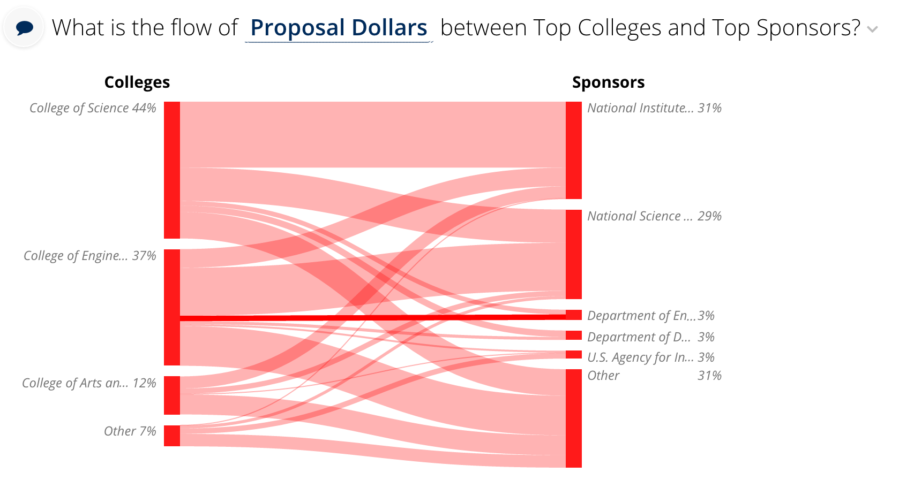

# Sankey \(done\)

## Sankey config

Sankey slices support the [common configuration options for all slices](../slices/slices-and-common-configuration.md). Additional options are:



```yaml
config:
  colorMap:
    "better": "#f00"
    "same": "#00f"
    "worse": "#fff"
  colors: ["#f00", "#fff", "#CCC"]
  linkHoverTextTemplateName: #sankey-link-hover
  nodeHoverTextTemplateName: #sankey-node-hover
  nodeTitleTemplateName: #sankey-node-title
  timePoints: ["Begin", "Finish"]
```



| Key | Optional | Values | Description |
| :--- | :--- | :--- | :--- |
| colorMap | Yes, will generate colors dynamically for each nodes defined in data \(colors are coming from either `config.colors` or will be auto-generated | A map with node names as keys and colors as values | Color map for each of the node names \(eg. better\|same\|worse\) |
| colors | Yes, will use `d3.scale.category10().range()` colors | Array of Colors | Predefined array of colors to be assigned to the node |
| linkHoverTextTemplateName | Yes, see SankeySliceView for default | CSS Selector | Template name whose content will be rendered when link is hovered |
| nodeHoverTextTemplateName | Yes, see SankeySliceView for default | CSS Selector | Template name whose content will be rendered when node is hovered |
| nodeTitleTemplateName | Yes, see SankeySliceView for default | CSS Selector | Template name whose content is displayed right next to the node \(node title\) |
| timePoints | Yes, default is `["Start", "End"]` | An array of length two, containing strings | The labels used as a title in the Start/End of the the Sankey flow |

## Flavors of Sankey

### bi-level

The bi-level flavor requires two dimensions that the values will be mapped between, and a single metric represents the value of the connection between the dimensions.



The code for the Sankey bi-level flavor looks as follows \(Note: Lists of keys for the first and second dimensions must be supplied via the render configuration. Also, you can include additional metadata as well.\)



```python
class SankeyService(NotredameQuarterlyService):

    def build_response(self):
        division_case_expression, singular='division')
        sponsors = ['National Institute...', 'Other']
        divisions = ['College of Science', 'Other']

        extra_metadata = {'sankey': {'format': '', 'label_plural': 'Colleges',
                                     'label_singular': 'College'}
                          }

        render_config = {'first_dimension_list': sponsors,
                         'second_dimension_list': divisions,
                         'metadata': extra_metadata}
        recipe = self.recipe()\
            .metrics(query_metric)\
            .dimensions(top3_sponsor_dim, top3_division_dim)\
            .filters(Filter(calendar_begindate >= self.start_date),
                     Filter(calendar_enddate <= self.end_date))

        self.response['responses'].append(
            recipe.render('Sankey', flavor='bi-level',
                          render_config=render_config))
```



```yaml
- slice_type: "sankey"
  slug: "sankey"
  title: "What is the flow of <strong><%= optionChooser1.selectionDisplay() %></strong> between\
    \ Top Colleges and Top Sponsors?"
  config:
    "timePoints":
    - "Colleges"
    - "Sponsors"
  data_service: "dataservice.SankeyService"
```



Any additional dimensions and metrics are not included in the output in any way.

