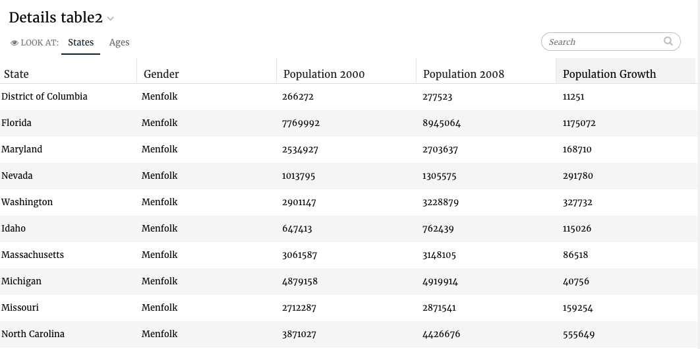

# Table

## Setting column widths

After a table response has been rendered, the response will contain a top level property columns that is a list. For each column in that list you can set a width property \(in pixels\).

Under the hood juicebox uses SlickGrid for the table slice. It sets a SlickGrid option `forceFitColumns` to `true`. As a result, the column widths are automatically adjusted and may be different from the value you specified.

To get the desired result, when specifying widths for the columns, it’s better to divide the viewport width \(normally 1120px, could be different when for example the slice has ‘wide’ style\) into the parts that are needed. So if the table is 1120px wide and there are two columns and they should display 60%-40% then one column’s width should be specified as 672 and the other column’s width as 448.

If a width is specified for one column then should be specified on all columns. Otherwise you will get unexpected results.

An example: The table slice is 1120px wide. The table has 4 columns. We want the 2nd column to be twice as wide as others are.

```text
recipe = ....  # build your recipe
response = recipe.render()
for i, column in enumerate(response['columns']):
    if i == 1:
        column['width'] = 448
    else:
        column['width'] = 224
self.response['responses'].append(response)
```


Slick Grid References:

[https://github.com/mleibman/SlickGrid/wiki/Grid-Options](https://github.com/mleibman/SlickGrid/wiki/Grid-Options) [https://github.com/mleibman/SlickGrid/blob/v2.0/slick.grid.js\#L937](https://github.com/mleibman/SlickGrid/blob/v2.0/slick.grid.js#L937)


## Flavors for Table

### Default \(table\)

The default flavor renders a table that contains all the dimensions in the supplied order followed by all the metrics in the supplied order.



The code for the default flavor looks as follows:

```text
class TableV3Service(CensusService):
    def build_response(self):
        self.metrics = ('pop2000', 'pop2008', 'popdiff')
        self.dimensions = ('state', 'sex')
        recipe = self.recipe().metrics(*self.metrics).dimensions(
            *self.dimensions)

        self.response['responses'].append(recipe.render())
```

The slice in stack.yaml:

```text
- slice_type: "details-table"
  slug: "table23"
  title: "Details table2"
  config:
    "name_field": "state"
    "slickgrid_id_field": "row_id"
  data_service: "censusv2service.TableV3Service"
```

## Including Summary data

Sometimes you will have the need to include a summary row to your table that shows the summarization of the metrics in the table, for e.g. the average of all the values for each column. Here we will walk through how you can accomplish that.

### Response Structure

The summary data for a table needs to be included in the data service response of that table as another item in the `data` array with a special name **summary**:

```text
"data": [
    {
        "name": "items",
        "values": [
            { "age": 30, "pop2000": 210382 },
            { "age": 40, "pop2000": 203341 }
        ]
    },
    {
        "name": "summary",
        "values": [
            { "unique_ages": 2, "pop2000": 413723 }
        ]
    }
]
```

And the `columns` array in the response would need to contain a mapping of the summary fields and their labels.

```text
"columns": [
    {
        "field": "age",
        "name": "Age",
        "summary_field": "unique_ages",
        "summary_label": "Unique:"
    },
    {
        "field": "pop2000",
        "name": "Population 2000",
        "summary_field": "pop2000",
        "summary_label": "Sum:"
    }
]
```

### Creating Summary data

Create an additional recipe that calculates the summary data along with the recipe that creates the data for the table.

Let’s look at an example. Below we have a Census table that contains population data for the years 2000 and 2008 across ages and gender for each state.

```text
class Census(Base):
    __table__ = Table('census', Base.metadata,
                    Column('state', String(30), primary_key=True),
                    Column('sex', String(1)),
                    Column('age', Float()),
                    Column('pop2000', Float()),
                    Column('pop2008', Float()),
                    schema='demo', extend_existing=True)
```

And the following metrics and dimension shelves have been setup:

```text
class BasicService(RecipeServiceBaseV3):
    metric_shelf = {
        'pop2000': Metric(func.sum(Census.pop2000),
                        singular='Population in the year 2000',
                        format=",.0f"),
        'pop2008': Metric(func.sum(Census.pop2008),
                        singular='Population 2008', format=".3s"),
    }

    dimension_shelf = {
        'state': Dimension(Census.state, singular='US State',
                        plural="US States"),
        'age': Dimension(
            Census.age, singular='Age', plural="Ages"),
    }

    # Automatically filter on these dimensions if they are selected.
    automatic_filter_keys = ('sex', 'state', 'age')

    def __init__(self, *args, **kwargs):
        super(BasicService, self).__init__(*args, **kwargs)
        self.Session = Session
```

The data service for our table that shows the population for the year 2000 for each age is:

```text
class DetailsTableService(BasicService):
    def build_response(self):
        recipe = self.recipe().metrics('pop2000').dimensions(
            'age').order_by('-age')

        response = recipe.render()
        self.response['responses'].append(response)
```

Now create the recipe that calculates our summary data. Here we want the number of unique ages and the sum of the population for the year 2000 across all the ages.

Define a new metric in the `metric_shelf` to get the unique ages:

```text
metric_shelf = {
    'unique_ages': Metric(func.count(distinct(Census.age)),
                          singular='Unique:', format=".0f"),
}
```

And add the summary recipe:

```text
class DetailsTableService(BasicService):
    def build_response(self):
        recipe = self.recipe().metrics('pop2000').dimensions(
            'age').order_by('-age')
        response = recipe.render()

        recipe = self.recipe().metrics('unique_ages', 'pop2000')
        summary_response = recipe.render()
```

Combine the summary response with the table response. We do this using the provided helper method `create_summary_table_response(base_response, summary_response)`.

**Note: This method expects the columns in the summary response to correspond with the columns in the base response. This means that the first column in the summary response should be the summary metric for the first column in the base response.**

Import the helper method:

```text
from dataservices.utils import create_summary_table_response
```

Then call it passing it the responses of the table and the summary:

```text
class DetailsTableService(BasicService):
    def build_response(self):
        recipe = self.recipe().metrics('pop2000').dimensions(
            'age').order_by('-age')
        response = recipe.render()

        recipe = self.recipe().metrics('unique_ages', 'pop2000')
        summary_response = recipe.render()

        response = create_summary_table_response(response, summary_response)
        self.response['responses'].append(response)
```

The labels used for displaying the summary data will be taken from the labels of the metrics in the summary response. You can however override them with a custom value by specifying a third parameter to `create_summary_table_response` called `summary_labels`. This is a dictionary, mapping a metric id to its label.

```text
class DetailsTableService(BasicService):
    def build_response(self):
        recipe = self.recipe().metrics('pop2000').dimensions(
            'age').order_by('-age')
        response = recipe.render()

        recipe = self.recipe().metrics('unique_ages', 'pop2000')
        summary_response = recipe.render()

        response = create_summary_table_response(response, summary_response,
                                                summary_labels={
                                                 'pop2000': 'Sum:'
                                                })

        self.response['responses'].append(response)
```

