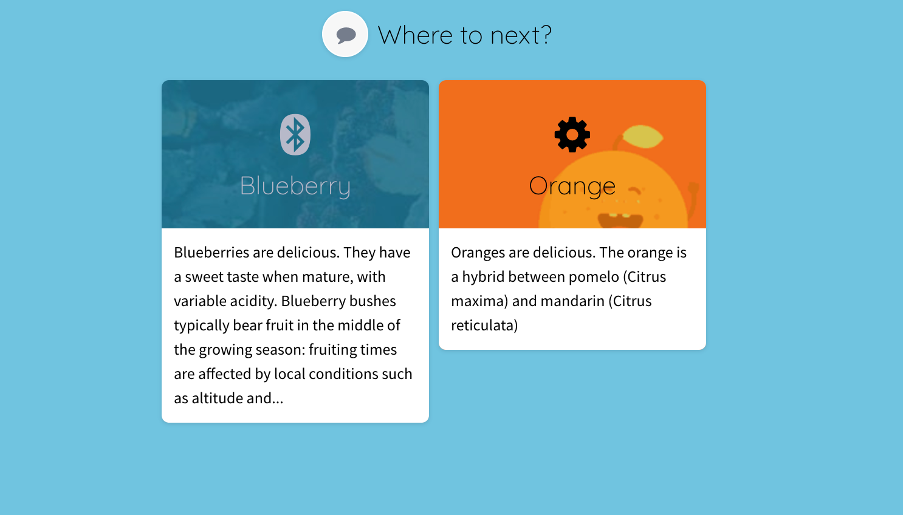

# Moving easily between stories, aka The Story Chooser Slice \(done\)

The story chooser slice provides better previews of what stories a user can explore next while effortlessly carrying forward filters with matching selections.



## Story setup


Each story can be customized by setting its `label`, `description`, `icon` or `story_theme` in `stack.yaml`. These values are used by the story chooser slice to customize the appearance of the card for that story.

### icon \(story\_chooser\)

An optional[ ](https://fontawesome.com/)[Font Awesome](https://fontawesome.com/) icon to use with the label.



```text
icon: "bluetooth"
```



### story\_theme

Settings to theme the card for this story in the story chooser slice.

You can use background images and customize any parameters for cropping or coloration or just use a background color. You can also choose whether the label will be light or dark so it can be read against the background.

Set a background image like this:



```text
story_theme:
    background:
        image: 'erwan-hesry-776630-unsplash.jpg'
        config:
            exp: -10
    text_color: light
```



Set a background color like this:



```text
story_theme:
    background:
        color: #e6d1f9
    text_color: dark
```



## Auto enable the story chooser

The story chooser can be auto-enabled on every stack by setting the `auto_inject_story_chooser` flag to `True` in the app’s metadata. It then shows up automatically at the bottom of every story. See how[ here](../app.yaml.md#metadata).

## Manually add the story chooser

The story chooser can also be manually added to every story by defining a slice with a type of `story-chooser` in `stack.yaml`. A data service will be automatically provided for it.



```text
- slice_type: "story-chooser"
  title: "Where do you <strong>really</strong> want to go next?"
  style:
    - wide
    - alignment-center
  config:
    collapsable: false
  background:
    color: "#f9f9f9"
  extra_css: |-
    padding: 50px 0 100px;
```



It’s possible to control which stories show up in the story chooser:



```text
- slice_type: "story-chooser"
  config:
    collapsable: false
    stories:
    - story: stack_slug_1
    - story: stack_slug_3
```



## Carrying forward filters

Switching between stories using the story chooser slice will carry forward any filters that are applied to the story chooser slice to the story being switched to.

These carried forward filters will then be applied on slices that have been enabled by turning on the `story_filter_carryover` flag.

* Filters whose `group_by_type` matches the `group_by_type` of the data will be applied and the rest discarded.
* The carried forward filters will take precedence over any selections from the hashr and/or server.

Here is an example that shows a slice that has been configured to apply any matching `group_by_type`’s that have been carried over when switching to a story with this slice in it.



```text
- slice_type: option-chooser
  config:
    story_filter_carryover: true
```



