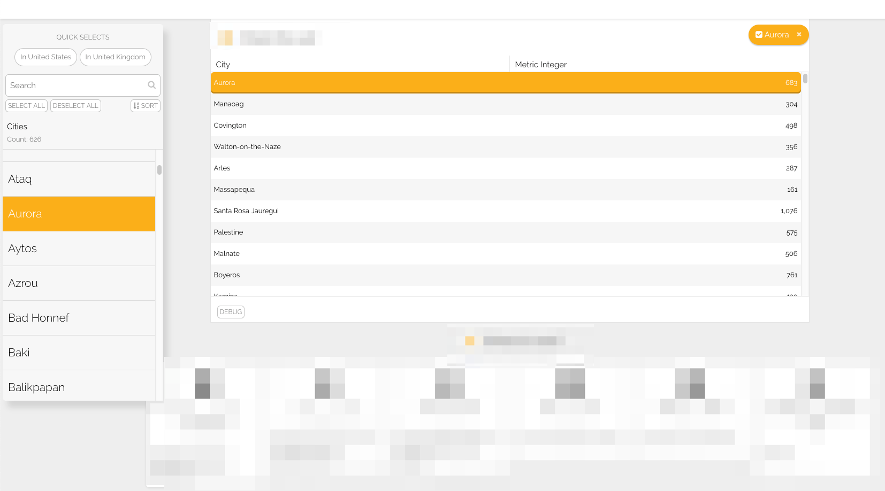
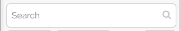
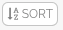

# Slice Side Panel

Slices that use the [display\_slice\_as](https://docs.juiceboxdata.com/projects/juicebox/topics/juicebox_reference/slices/common_configuration.html#display-slice-as) configuration option gain use of a pop-out side panel for browsing, searching, sorting and selecting a given slice’s data. The side panel can toggled on/off by clicking the associated slice’s filter pill.

**Quick Selects**

‘Quick Selects’ are named filters defined at the `ingredient` level that allow batch-selection of items that meet a certain criteria. If any exist on a currently used ingredient, they will be displayed here.

**Searching**

Users may search slice data in the side panel.

* Searches will always be on an item’s **label** property.
* If slice data is hierarchical, search will be performed on each level of the hierarchy and results will be displayed as a flat list.

**Select All / Deselect All**

Users may easily select/deselect all slice items in a given list. Once one of these actions is performed, users may select/deselect individual items by clicking them without affecting the overall selection state.

If slice data is hierarchical, only the current level of hierarchy will be selected/deselected.

**Sorting**

Users may sort slice items in ascending or descending order.

_Slices with metric values…_

* are numerically sorted by each item’s metric value
* are sorted in **descending** order by default

_Slices without metric values…_

* are sorted alphanumerically by each item’s label value
* are sorted in **ascending** order by default

**Slice data**

The side panel displays the associated slice’s data in a list structure.

Item selection and interaction in the side panel is also reflected in the main slice body.

There are three list types in which data will be presented, depending on the associated slice’s type.

**Flat**

Slice data represented in a flat list is the default structure represented in the side panel.

**Hierarchical**

Slice data that is hierarchical in nature is navigable in the side panel by way of buttons attached to ‘parent items’.

Users can also traverse backwards in a hierarchy by clicking the individual breadcrumbs in the side panel header.

**Ranged**

Trend slices are currently the only slice that employs ranged lists.

This list type will allow users to select a start item and/or an end item, both of which are reflected in the slice visualization.

If no ‘start item’ is selected, the first item in the dataset is selected by default. Similarly, if no ‘end item’ is selected, the last item in the dataset is selected by default.

