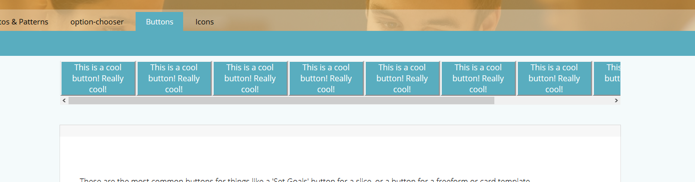
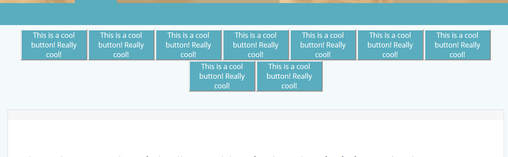
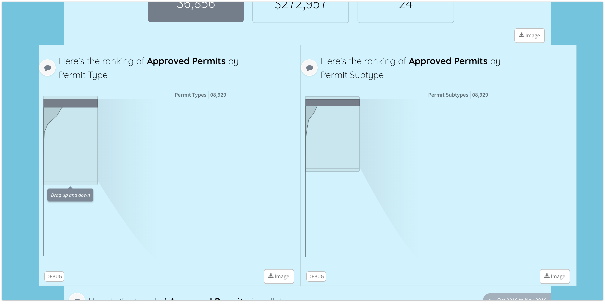

# Grouping Slices \(done\)

Slices can be grouped together and visually presented as a group in a story. Grouping of slices enables:

> * slices to filter each other
> * slices to be laid out visually together \(vertically or horizontally\) within a story
> * sharing of common config across slices

## Defining a Group

Groups are defined in `stack.yaml` using the `slice_group` and `slices` attributes, like so:



```text
label: "My story"
slices:
  - slice_group: mycoolgroup # follows slug rules
    slices:
      - slice_type: option-chooser
        slug: states_dropdown
        title: "What states would you like to look at?"

      - slice_type: option-chooser
        slug: cities_dropdown
        title: "What cities would you like to look at?"
```



## Cross-filtering slices in a group

To allow all the slices in a group to filter each other in addition to being filtered by slices above them, set up the group with the `filtering: crossfilter` option.



```text
label: "My story"
slices:
  - slice_group: mycoolgroup # follows slug rules
    filtering: crossfilter
    slices:
      - slice_type: option-chooser
        slug: states_dropdown
        title: "What states would you like to look at?"

      - slice_type: option-chooser
        slug: cities_dropdown
        title: "What cities would you like to look at?"
```



Cross-filtering updates each slice’s `eventmap` to listen to each other. However, each slice data service will still need to be configured to perform proper filtering. If any of the slices in a cross-filtering group have their `eventmap` explicitly defined then its value will take precedence over the `filtering: crossfilter` option.

## Sharing common slice config

Properties common across all slices in a group can be specified in one place instead of repeating it for each slice in the group.



```text
label: "My story"
slices:
  - slice_group: mycoolgroup # follows slug rules
    shared:
        include_commands:
            - download-data
        config:
            minSelections: 1
    slices:
      - slice_type: option-chooser
        slug: states_dropdown
        title: "What states would you like to look at?"

      - slice_type: option-chooser
        slug: cities_dropdown
        title: "What cities would you like to look at?"
```



A property defined on an individual slice in a group will be overwritten by the value of that property defined under `shared`.

## Styling Slice Groups

You can change the layout, width and backgrounds of slice groups.

### Layouts

Slices in a group can be laid out in the following ways:

`scroll-horizontal`: When setup as `group_layout: scroll-horizontal`, the slices are laid out next to each other horizontally. A scroll bar appears when there are more slices than can fit within the width of the story page.





```text
label: "My story"
slices:
  - slice_group: mycoolgroup # follows slug rules
    group_layout: scroll-horizontal
    slices:
      - slice_type: option-chooser
        slug: states_dropdown
        title: "What states would you like to look at?"

      - slice_type: option-chooser
        slug: cities_dropdown
        title: "What cities would you like to look at?"
```



`wrap`: Slices in a group with `group_layout: wrap` are laid out next to each other horizontally and wrap to the next line if there are more slices than can fit within the width of the story page.





```text
label: "My story"
slices:
  - slice_group: mycoolgroup # follows slug rules
    group_layout: wrap
    slices:
      - slice_type: option-chooser
        slug: states_dropdown
        title: "What states would you like to look at?"

      - slice_type: option-chooser
        slug: cities_dropdown
        title: "What cities would you like to look at?"
```



`stack`: This is the default layout and is the current layout of the slices where they are stacked one below the other.

### Wide Slice Groups

Slice groups can take up the full width of the browser window. Use the `group_style` config to define them as `wide`. Each slice inside a group still controls its own width.





```text
label: "My story"
slices:
  - slice_group: mycoolgroup # follows slug rules
    group_style:
        - "wide"
    slices:
      - slice_type: option-chooser
        slug: states_dropdown
        title: "What states would you like to look at?"

      - slice_type: option-chooser
        slug: cities_dropdown
        title: "What cities would you like to look at?"
```



### Backgrounds

Slice groups can be given a `background` as defined in [Styling Backgrounds](../../enhancements-contents/styling-and-formatting/untitled-1.md#styling-backgrounds).




```text
label: "My story"
slices:
  - slice_group: mycoolgroup # follows slug rules
    background:
        image: 'erwan-hesry-776630-unsplash.jpg'
        config:
        exp: 0
        blend: 1E708E
        bm: normal
        balph: 90
    slices:
      - slice_type: option-chooser
        slug: zipcodes_dropdown
        title: "Select one or more Zipcodes to focus in on"

      - slice_type: option-chooser
        slug: council_dropdown
        title: "Select one or more Council Districts to focus in on"

      - slice_type: option-chooser
        slug: cities_dropdown
        title: "Select one or more Cities to focus in on"
```



