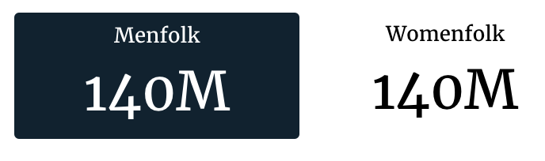
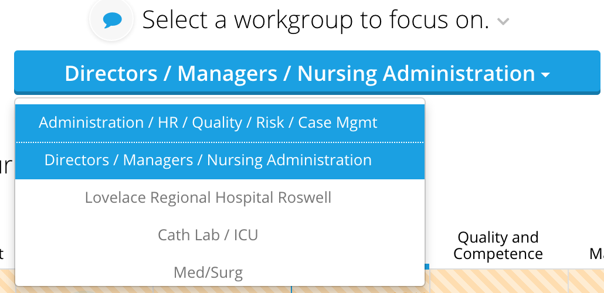

# Option Chooser Slice

Play around with configs and view demos at [http://localhost:8000/jb3\_slice\_reference/option\_chooser](http://localhost:8000/jb3_slice_reference/option_chooser) \(jingwei only, for now :p\)

## Option Chooser Config



Option chooser slices support the Common configuration options for all slices. Additional options are list below. All options are optional \(&gt;\_&lt;\) unless otherwise stated.

#### containerExtraClass

The additional css class name that would be added to the options container. The css class would be added to HTML element `<div class='options-container'>`

| value | default |
| :--- | :--- |
| css class name | null |

Example:

```yaml
config:
    containerExtraClass: my-custom-option-container-css-class
```

#### groups

Overrides default option settings for specified chooser

| value | default |
| :--- | :--- |
| An object with option name as a key and {minSelections, maxSelections} properties | null |

Example:

```yaml
config:
    groups:
        course:
            minSelections: 1
        patient:
            minSelections: 0
            maxSelections: 4
```

#### hasFilterText

Should the slice display its local filter text \(selection\). Typically, this slice does not display filter text, so it is disabled by default. You need to explicitly enable it to display filter/selection text.

| value | default |
| :--- | :--- |
| boolean | false |

Example:

```yaml
config:
    hasFilterText: true
```

#### optionTemplateName

The name of the template for the options.

| value | default |
| :--- | :--- |
| css selector for the template | null \(will use the default template\) |


This option is ignored when the option chooser is setup with the drop down mixin.


#### templateField

Name of the field in data item that refers to the template defined in template.html. Useful if data items should render different templates.

| value | default |
| :--- | :--- |
| name of the field that will contain template name | null \(will use the default template\) |

#### selectorTemplateName

The name of the template for the container/selector

| value | default |
| :--- | :--- |
| The name of the template for the container/selector | null \(will use the default template\) |

#### showTitles

Whether the selection names are visible right in front of the selection options.

| value | default |
| :--- | :--- |
| boolean | true |



## Flavors

### Default \(Metric Chooser\)

The default flavor renders on the distinct elements of a single dimension, and shows the value of a single metric of that dimension.

#### Recipe requirements

|  |  |
| :--- | :--- |
|  \# dimensions | 1 |
|  \# metrics | 1 |

#### Example





```yaml
- slice_type: "option-chooser"
  slug: "bar"
  title: "This could stay here"
  config:
    optionExtraClass: "option-item-fixed-width"
    optionTemplate: |-
            <div data-id="<%= datum.id %>" class="group-container__item"><div class="group-container__item__label"><%= datum.label%></div><div class="group-container__item__value"><%= datum.format('value', undefined, 'id') %></div></div>
    showTitles: false
    minSelections: 1
    maxSelections: 1
  data_service: "censusv2service.FirstChooserV3Service"
```



```python
metrics = ['pop2000']
dimensions = ['sex']
recipe = self.recipe().metrics(metrics).dimensions(*dimensions)
response = recipe.render()
self.response['responses'].append(response)
```



## Dropdown

#### Recipe requirements

|  |  |
| :--- | :--- |
|  \# dimensions | 1 |
|  \# metrics | 0 |

#### Example





```yaml
- slice_type: "option-chooser"
  slug: "option-chooser2"
  title: "Select a workgroup to focus on."
  style:
  - "section-content"
  config:
      "minSelections": 1
      "maxSelections": 1
  mixins:
  - "options":
      "optionsRange":
          - 1
          - 10000
    "target": "view"
    "class": "OptionChooserWithDropdownViewMixin"
  data_service: "EIDataServices.OptionChooser2Service"
```



```python
dimensions = ['unit']
recipe = self.recipe().dimensions(dimensions)
response = recipe.render('OptionChooser', flavor='dropdown')
self.response['responses'].append(response)
```




## Flavors 222

### Default \(Metric Chooser\)

The default flavor renders on the distinct elements of a single dimension, and shows the value of a single metric of that dimension.

#### Recipe requirements

|  |  |
| :--- | :--- |
|  \# dimensions | 1 |
|  \# metrics | 1 |

#### Example



```yaml
- slice_type: "option-chooser"
  slug: flavor_default
  title: 'Flavor: Default'
  config:
    optionTemplateName: "#option-chooser-metric-item-template"
  data_service: option_chooser_service.FlavorDefaultService
```



```python
    def build_response(self):
        recipe = self.recipe().dimensions('sex').metrics('pop2000')
        response = recipe.render()
        self.response['responses'].append(response)
```



## Dropdown

#### Recipe requirements

|  |  |
| :--- | :--- |
|  \# dimensions | 1 |
|  \# metrics | 0 |

#### Example



```yaml
- slice_type: "option-chooser"
  slug: flavor_dropdown
  title: 'Flavor: Dropdown'
  data_service: option_chooser_service.FlavorDropdownService
  mixins:
  - "options":
      "optionsRange":
          - 1
          - 10000
    "target": "view"
    "class": "OptionChooserWithDropdownViewMixin"
```



```python
class FlavorDropdownService(BasicService):

    def build_response(self):
        dimensions = ['state']
        recipe = self.recipe().dimensions(*dimensions)
        response = recipe.render(flavor='dropdown')
        self.response['responses'].append(response)
```



### Metric

The metric flavor is used to create a horizontal list without using any dimensions, and shows a summary rollup for each metric.

#### Recipe requirements

|  |  |
| :--- | :--- |
|  \# dimensions | 0 |
|  \# metrics | 1 \(or more\) |

#### Example



```yaml
- slice_type: "option-chooser"
  slug: flavor_metric
  title: 'Flavor: Metric'
  data_service: option_chooser_service.FlavorMetricService
```



```python
def build_response(self):
    metrics = ['pop2000', 'pop2008']
    recipe = self.recipe().metrics(*metrics)
    response = recipe.render(flavor='metric')
    self.response['responses'].append(response)
```




