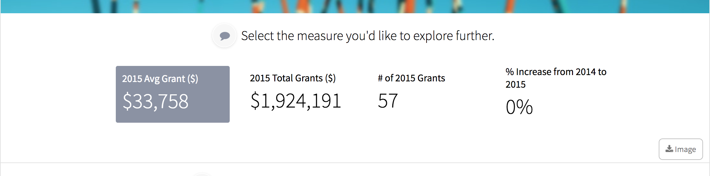
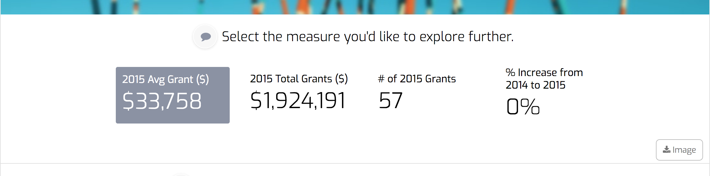
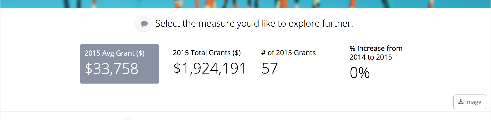
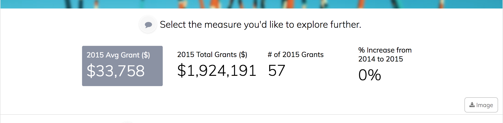

# theme.yaml

**Theme.yaml** defines the visual look and feel of the application.

```text
app.yaml
theme.yaml   <--- You are here
help/
public/
stacks/
      stackname/
            dataservice.py
            stack.yaml
            templates.html
            fixtures/
            help/
```

## Theme.yaml Options

### logo \(theme\)

Logos are defined the same way as image-background. The image can be a url link or an image in the `public/img/` directory.

You must set the logo height using the `h` property in config. You can use any of the [Imgix API](https://docs.imgix.com/apis/url/dpr) options to modify the image. Logos automatically use a retina resolution logo \(the same as if you had set `dpr: 2` in the [Imgix API for DPR](https://docs.imgix.com/apis/url/dpr)\). It's best if you use an image that is twice the height that you want to show on screen.

```python
logo:
  image: 'http://logok.org/wp-content/uploads/2014/06/IBM-logo-blue.png'
  config:
    h: 120
```

This is what the logo looks like.


You can do much fancier things with the Imgix API. This example puts a red background behind the logo, then masks it with a circle.

```python
logo:
  image: 'http://logok.org/wp-content/uploads/2014/06/IBM-logo-blue.png'
  config:
    h: 120
    w: 120
    fit: 'crop'
    mask: 'ellipse'
    bg: 'ff0000'
```

This is what the "enhanced" logo looks like.


### Variables

Theme variables can be modified to change the style and layout of the entire applications. The following are the default settings for each variable. Any can be placed in the `variables` sections of the `theme.yaml` file to edit the theme.

Here's an example with variables that have been customized:

```text
variables: |-
  $theme-primary-color: #59adbf;
  $theme-accent-color: #eea83c;
  $theme-header-image: 'https://fruition-snapshots.s3.amazonaws.com/patterns/Research2-cropped.jpg';
  $theme-page-header-background-color: rgba(238, 168, 60, 0.6);
  $theme-page-header-height: 130px;
  $theme-header-app-title: true;
  $theme-slice-margin-left: 40px;
  $theme-page-header-image-ypos: -100px;
```

#### Color variables

```text
// COLORS
// ----------------------------
$theme-primary-color: #1ba0e2;
$theme-accent-color: #fc932a;
$theme-benchmark-color: #C10AD8;
$theme-target-color: #FB9E1E;
$theme-dark-color: #000;
$theme-light-color: #fff;
$theme-good-color: #B1E07E;
$theme-bad-color: #ED9998;
$theme-alert-color: #CB001A;
$theme-comparison1-color: #1F77B4;
$theme-comparison2-color: #FF7F0E;
$theme-comparison3-color: #2CA02C;
$theme-comparison4-color: #D62728;
$theme-comparison5-color: #9467BD;
```

#### Layout variables

```text
// LAYOUT
// ----------------------------
$theme-slice-sequence-style: 'non-linear'; // non-linear, linear
```

#### Shape variables

```text
// SHAPE
// ----------------------------
$theme-base-radius: 6px;
$theme-shadows: true; // so far only controls table selection rows
```

#### Spacing variables

```javascript
// SPACING
// ----------------------------
$theme-base-margin: 8px;
```

#### Font variables

```text
// FONTS
// ----------------------------
$theme-base-font: 'Open Sans' !default;
$theme-display-font: $theme-base-font !default;
$theme-headline-font: $theme-base-font !default;
$theme-caption-font: $theme-base-font !default;
$theme-controls-font: $theme-base-font !default;
$theme-discussions-font: 'Merriweather' !default;

$theme-base-font-stack: #{$theme-base-font}, 'Helvetica Neue', Helvetica, Arial, sans-serif !default;
$theme-display-font-stack: #{$theme-display-font}, 'Helvetica Neue', Helvetica, Arial, sans-serif !default;
$theme-headline-font-stack: #{$theme-headline-font}, 'Helvetica Neue', Helvetica, Arial, sans-serif !default;
$theme-caption-font-stack: #{$theme-caption-font}, 'Helvetica Neue', Helvetica, Arial, sans-serif !default;
$theme-controls-font-stack: #{$theme-controls-font}, 'Helvetica Neue', Helvetica, Arial, sans-serif !default;
$theme-discussions-font-stack: #{$theme-discussions-font}, Georgia, serif !default;
```

#### Animation variables

```text
// ANIMATION
// -------------------------
$theme-transition-length: 0.8s;
```

#### App background variables

```text
// APP 
// ---------------------
$theme-background-isImage: false; 
$theme-header-app-title: false;
$theme-login-background-isPhoto: false; 
$theme-login-background-image: '';
```

#### Stack background variables

```text
// STACK 
// ---------------------
$theme-body-background-color: transparentize($primary-color-light, .85);
$theme-stack-background-color: transparent;
$theme-stack-border: false;
$theme-stack-border-color: $dark-color-faintest;
```

#### Page header variables

```text
// Page Header
// ---------------------
$theme-header-image: '';
$theme-page-header-image-xpos: 0px;
$theme-page-header-image-ypos: 0px;
$theme-page-header-background-color: transparent;
$theme-page-header-navitems-background-color: $theme-primary-color;
$theme-page-header-actions-background-color: $theme-primary-color;
$theme-page-header-height: 0px;
$theme-page-header-style-dark-stacks: ();
$theme-page-header-hide-nav: false;
```

#### Slice variables

```text
// General Slice variables
// --------------------------
$theme-slice-background-color: $theme-light-color;
$theme-slice-margin-left: 10px;
$theme-slice-style: 'column'; // column, card
```

## Recommended Fonts

Choosing a font is as simple as setting the **$theme-base-font** variable in the **theme.yaml** file in an app. Here are fonts that we recommend, grouped in different themes.

### Technical Fonts

```text
// theme.yaml
$theme-base-font: 'Source Sans Pro'
```



### Storytelling / Narrative Fonts

```text
// theme.yaml
$theme-base-font: 'Rubik'
```


```text
// theme.yaml
$theme-base-font: 'Quicksand'
```


### Modern Fonts

```text
// theme.yaml
$theme-base-font: 'Libre Franklin'
```


```text
// theme.yaml
$theme-base-font: 'Exo'
```



```text
// theme.yaml
$theme-base-font: 'Overpass'
```


```text
// theme.yaml
$theme-base-font: 'Lato'
```


### Classic Fonts

```text
// theme.yaml
$theme-base-font: 'Open Sans'
```



```text
// theme.yaml
$theme-base-font: 'Muli'
```



### Professional Fonts

```text
// theme.yaml
$theme-base-font: 'Spectral'
```


```text
// theme.yaml
$theme-base-font: 'Lora'
```


