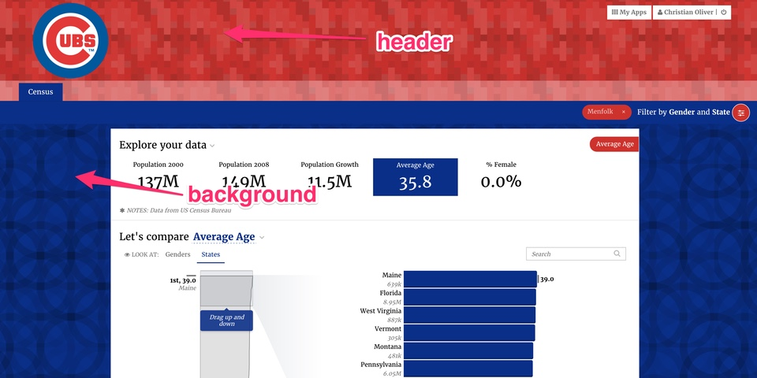
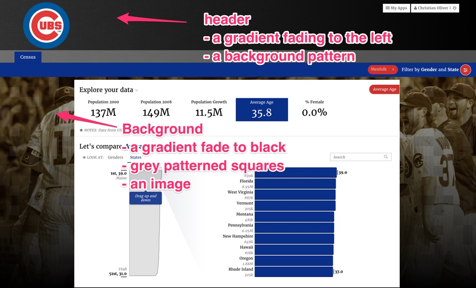

# Applying Backgrounds to Stacks and Slices \(needs small amount of work that I can't do\)

## Styling Backgrounds

Stacks and slices can define backgrounds using a `background` property in yaml. Stacks can also define a separate background for the top of the page using `header`. Backgrounds can be images, patterns, gradients or colors. You can even layer multiple backgrounds together.

### Image Background

| key | value |
| :--- | :--- |
| image: | A url or an image in your app’s public/img directory |
| extra: | Optional extra css properties for your image that are supported by the css background property. For instance, you can set an image to be centered, fixed and no-repeating with `no-repeat fixed center` |
| config: | A key/value list of modifications supported by the imgix url api. See [https://docs.imgix.com/apis/url](https://docs.imgix.com/apis/url) |

Checkout this example:



```yaml
header:
  image: 'http://www.cookandsonbats.com/panoramas/wrigley/wrigley-404-504.jpg'
  config:
    w: 1920
    blur: 50
background:
  - image: 'http://a.fssta.com/content/dam/fsdigital/fscom/mlb/images/2015/07
  /27/072715-7-MLB-Chicago-Cubs-OB-PI.vresize.1200.675.high.6.jpg'
    extra: "0 250px"
    config:
      w: 1920
      sepia: 100
```



The first image is blurred with a width of 1920 pixels. The second image is sepia toned with a width of 1920 pixels. It uses the extra to move that image down 250px. In the app, this looks like:


### Improving Readability

If there is an image used in the header where the contrast doesn’t seem strong enough, try tinting your image with another color through the config. In the following example, the blend color is chosen, the blend mode `bm` is set to normal, and it is made slightly transparent with `balph`.



```yaml
  background:
# Set the story image:
- image: APA_image.jpg
  config:
    blur: 8
    # Set the blend to the primary color:
    blend: "005499"
    bm: normal
    balph: 70
    h: 540
  extra: "0/cover no-repeat"
```




If you use blend, surround the color by quotes so it’s not treated as an integer.


### Pattern Background

<table>
  <thead>
    <tr>
      <th style="text-align:left">key</th>
      <th style="text-align:left">description/value</th>
    </tr>
  </thead>
  <tbody>
    <tr>
      <td style="text-align:left">pattern:</td>
      <td style="text-align:left">
        <p></p>
        <ul>
          <li>bricks</li>
          <li>hexagons</li>
          <li>overlapping_circles</li>
          <li>overlapping_rings</li>
          <li>plaid</li>
          <li>plus_signs</li>
          <li>rings</li>
          <li>sinewaves</li>
          <li>squares</li>
          <li>triangles</li>
          <li>xes</li>
        </ul>
      </td>
    </tr>
    <tr>
      <td style="text-align:left">extra:</td>
      <td style="text-align:left">Optional extra css properties for your image that are supported by the
        css background property.</td>
    </tr>
    <tr>
      <td style="text-align:left">config:</td>
      <td style="text-align:left">Configuration options include color, scale, seed, and opacity.</td>
    </tr>
  </tbody>
</table>Here’s an example of a stack.yaml `header` and `background` using patterns.



```yaml
header:
  pattern: 'plus_signs'
  config:
    color: '#CC3433'
    scale: 4
background:
  pattern: 'overlapping_rings'
  config:
    color: '#0E3286'
    scale: 12
```



The first image is a relatively small plus\_sign pattern using the accent color. The second image is a larger ring pattern using the primary color.



This table shows examples of all patterns at small, medium, and large scales.

## I Can't Pull These Images From the Old Docs

### Pattern Examples

| Pattern | scale: 2 | scale: 7 | scale: 13 |
| :--- | :--- | :--- | :--- |
| bricks |  |  |  |
| hexagons |  |  |  |
| overlapping\_circles |  |  |  |
| overlapping\_rings |  |  |  |
| plaid |  |  |  |
| plus\_signs |  |  |  |
| rings |  |  |  |
| sinewaves |  |  |  |
| squares |  |  |  |
| xes |  |  |  |
| triangles |  |  |  |

You can integrate any of these very easily by following this template:



```yaml
background:
  - pattern: {pattern}
    config:
      color: "#F05C5E"
      scale: {scale}
```



### Gradient Background

| key | value/definition |
| :--- | :--- |
| gradient: | A css3 gradient to use. You only need to specify the linear-gradient or radial-gradient. |
| extra: | Optional extra css properties for your gradient that are supported by the css background property. For instance, you can set an pattern to be centered, fixed and no-repeating with `no-repeat fixed center` |

Here’s an example of a stack.yaml `header` and `background` using gradients. A good source of visually interesting gradients is [http://uigradients.com/](http://uigradients.com/)



```yaml
header:
  gradient: 'linear-gradient(to bottom, #7b4397 , #dc2430)'
background:
  gradient: 'linear-gradient(to left, #7b4397 , #dc2430)'
```



### Color Background

| key | value |
| :--- | :--- |
| color:  | A hex, rgb, rgba, or css named color to use |
| extra: | Optional extra css properties for your color that are supported by the css background property. For instance, you can set an pattern to be centered, fixed and no-repeating with `no-repeat fixed center` |

## Need pics for this one too

| Color Type | Key/Value | Result |
| :--- | :--- | :--- |
| hex color | color: '\#CC3433' |  |
| rgb color | color: 'rgb\(255, 90, 0\)' |  |
| rgba color | color: 'rgba\(255, 90, 0, 0.5\)' |  |
| named color | color: 'goldenrod' |  |

Here’s an example of a stack.yaml `header` and `background` using colors.



```yaml
header:
  color: '#CC3433'
background:
  color: '#0E3286'
```



The header uses the accent color and the body background uses the primary color.


## Layering multiple backgrounds

You can combine images, gradients, colors and patterns to create sophisticated effects. The background property can take a list of backgrounds as defined above. The first item in the list will be on top and the others will appear as layers below it. Here’s an example:



```yaml
header:
  - gradient: 'linear-gradient(to right, rgba(0, 0, 0, 0.5) , rgba(0, 0,
   0, 1))'
  - image: 'http://subtlepatterns2015.subtlepatterns.netdna-cdn.com/patterns/grey_wash_wall.png'
background:
  - gradient: 'linear-gradient(to bottom, rgba(255, 255, 255, 0) , rgba(0, 0,
   0, 1))'
  - pattern: 'squares'
    config:
      color: '#333333'
      scale: 6
      opacity: 0.2
  - image: 'http://a.fssta.com/content/dam/fsdigital/fscom/mlb/images/2015/07/27/072715-7-MLB-Chicago-Cubs-OB-PI.vresize.1200.675.high.6.jpg'
    extra: "0 250px"
    config:
      w: 1920
      sepia: 100
```



The header has a background grey pattern image from [http://subtlepatterns](http://subtlepatterns/) .com\_ with a gradient fading to full black on the right on top of the pattern. The background has an image with a dark squares pattern on top and a final fade to black gradient on top of that.

Here’s what it looks like together.



