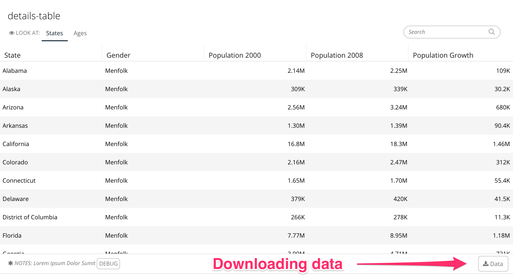
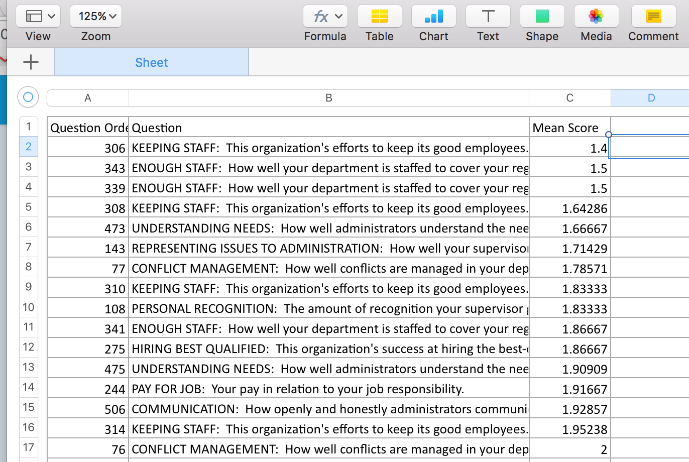

# Downloading Slice Content

## Supporting downloads in the data service

Downloads are automatic for table slices. To enable downloads, import the `DownloadTable` mixin and make sure it is the class you inherit from before your base service class.

In addition, in stack.yaml, add the “download-data” command in the included commands for the slice.



```python
from dataservices.mixins import DownloadTable

class TableService(DownloadTable, BaseService):
    """
    Creates a table
    """
    def __init__(self, *args, **kwargs):
        ...
```



```
include_commands:
  - "download-data"
```







## Customizing the data service when running a download

Sometimes the data service needs to be different when running a download. A common case is showing a limited number of table rows in the browser but allowing all rows to be downloaded. When running a data service, `self .download` will be true when you are generating data for a download.

This example will limit a table to show only 10,000 rows when displayed in the browser, but allow all rows to be downloaded.



```python
recipe = ...
if not self.download:
   recipe = recipe.limit(10000)
```



## Customizing download files

Any slice can create custom download content by supporting **all three** of the following methods on the data service. The data service will run normally and create a response. After that response is created, you can transform it into the content you want the user to download.

### download\_filename\(\)

Returns the filename of the download. The current title of the slice at the time the user clicked the download button is available as `self .params['downloadFilename']`. The `download_filename` provided with the `DownloadTable` mixin is here:



```python
def download_filename(self):
    filename = self.params['downloadFilename'] if 'downloadFilename' in self.params else 'download'
    filename = filename.strip()
    filename = re.sub(r'[,;"]', '', filename)
    return '"' + filename + '.xlsx' + '"'
```



If you use the `self.params['downloadFilename']` it’s necessary to clean it by removing commas and semicolons to avoid cross-browser issues.

### download\_mimetype\(\)

You must supply a mimetype for the downloaded content. This will determine the file type of your content. The `download_mimetype()` supplied with the `DownloadTable` mixin is:



```python
def download_mimetype(self):
    return 'application/vnd.openxmlformats-officedocument.spreadsheetml.sheet'
```



For a csv download, you would add the following:



```python
def download_mimetype(self):
    return 'text/csv'
```



### download\_content\(\)

Finally, `download_content` uses data from the regular data service response \(which is available in `self.response`\) to create file content.



```python
def download_content(self):
    data = self.data_for_download()
    workbook = get_virtual_workbook(data)
    return workbook
```



For a csv download, you do not need to create a workbook. Instead, you will need to transform the data into a string that can be used as the file content.



```python
def download_content(self):
    data = self.data_for_download()

    multi_line = ""
    for i, item in enumerate(data):
        # allows for rows
        if i > 0:
            multi_line = multi_line + '\n'

        # make sure all values are converted to a str type
        new_line = ','.join(map(str, item))

        multi_line = multi_line + new_line

    return multi_line
```



